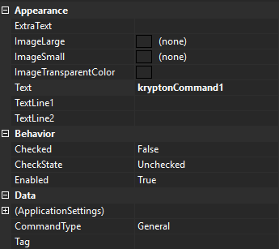

# KryptonCommand

 

Use the *KryptonCommand* component to simplify the management of application
actions.

 

For example, you could use a *KryptonCommand* instance to manage the state
of your applications *Print* action. Your application might have three separate
places where feedback is provided to the user about the availability of the
*Print* capability. Instead of updating all three controls each time the *Print*
state changes you only need to update the single command. The three attached
controls will then be updated automatically. Just assign the command instance to
the *KryptonCommand* property of any compatible control and the control will
automatically keep itself in sync with the command state.  
  
The command also exposes an event called *Execute* that you should hook into for
notification of when the command needs to be executed. When the user presses a
button that is attached to a command the button will cause the *Execute* event
to be fired. So management of your *Print* action could not be easier. Just
attach the command to your *KryptonButton*, *KryptonCheckButton*, *ButtonSpec*,
*KryptonRibbon* element etc and those controls will automatically show the
correct command state for you. Then when the user presses the *KryptonButton*,
*ButtonSpec* etc the *Execute* event will fire so you can process the *Print*
request.

KryptonCommand Properties  
Figure 1 shows the list of properties exposed by the *KryptonCommand* component.

 

 *Figure 1 - KryptonCommand properties*  

 

**ExtraText**  
This is the supplementary text used by attached controls for display.

**ImageLarge**  
**ImageSmall**  
Most attached controls will use the *ImageSmall* property value but the
*KryptonRibbon* elements sometimes require a large image, in which case the
ImageLarge property will be used instead.

**ImageTransparentColor**  
A collection that contains the top level set of context menu items.

**Text**  
This is the main text used by attached controls for display. 

**TextLine1**  
**TextLine2**  
These two text values are for use by *KryptonRibbon* elements that require two
display strings. When a *KryptonRibbon* button is displayed inside a group in
large format it draws the two lines of text as provided by these properties.

**Checked**  
**CheckState**  
Some attached controls can provide checked state feedback. So if you attached a
*KryptonCheckButton* to this command it will be able to display correctly the
*Checked* property value which is a boolean type. But it will not display the
*CheckState* value because the *KryptonCheckButton* has no way to indicate an
indeterminate state. If you attach a *KryptonCheckBox* then the CheckState
property would be used. If the attached control cannot provide checked
information, such as a *KryptonButton*, then these properties would be ignored
by that attached control.

**Enabled**  
Determines if the command should be enabled or disabled for use. When disabled,
any attached controls will show themselves as disabled in order to prevent the
command from being executed.

**Tag**  
Use the *Tag* to assign your application specific information with the component
instance.
