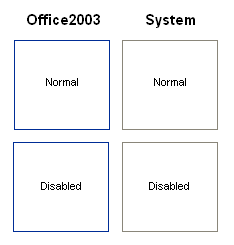

# KryptonGroup

 

Use the *KryptonGroup* control when you need to group related controls together.
For example, you can use groups to subdivide a form into distinct areas. Moving
the group will cause all the contained controls to also be moved along with it
as it acts as a container. This control is similar to the *KryptonPanel* except
it provides a border as well as a background.

 

The *KryptonPanel* is more suited towards providing the background for large
sections of the client area. *KryptonGroup* is more suitable for grouping a
small number of related controls together.

 

**Appearance** 

The *GroupBackStyle* and *GroupBorderStyle* properties are used to define the
top level styling required for the appearance of the *KryptonGroup* control. The
default value of *ControlClient* for both properties gives an appearance
appropriate for grouping together related controls. Alternatively use
the *ControlAlternate* setting for a group that needs to stand out. There is
also a custom style that can be defined via a *KryptonPalette* for situations
where you need to create a variation on the styles already provided. The custom
style is called simply *Custom1*.

 

**Two States** 

Only two possible states of *Disabled* and *Normal* are used by the group
control. In order to customize the appearance use the corresponding
*StateDisabled* and *StateNormal* properties. Note that only the background and
border characteristics can be modified as the group control never has a content
value.

 

To speed up the customization process an extra *StateCommon* property has been
provided. The settings from this are used if no override has been defined for
the state specific entry. Note that the specific state values always take
precedence and so if you define the background color in *StateNormal* and
*StateCommon* then the *StateNormal* value will be used whenever the control is
in the *Normal* state. Only if the *StateNormal* value is not overridden will it
look in *StateCommon*.

 

**Examples of Appearance** 

Figure 1 shows the appearance when *GroupBackStyle* and *GroupBorderStyle* are
both defined as the default *Control1*. You can see that the *Disabled* and
*Normal* states have the same appearance. If you need to show the group is
disabled then you can alter the *StateDisabled* property as required.

*Figure 1 – KryptonGroup examples*
