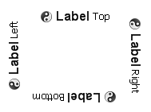
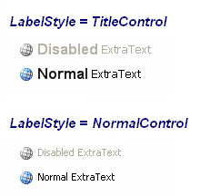

# KryptonLabel

 

Use the *KryptonLabel* control when you need display text and images combined
with the styling features of the *Krypton Toolkit*. For example, you can use the
label to add descriptive captions to other controls such as text boxes or list
boxes. The content of the control is contained in the *Values* property. You can
define *Text*, *ExtraText* and *Image* details within the *Values* property.

 

**Appearance** 

The *LabelStyle* property is used to define the top level styling required for
the appearance of the *KryptonLabel* control. The four standard values are
*NormalControl*, *TitleControl*, *NormalPanel* and *TitlePanel*. It is important
to understand when to use which style in order to get the correct appearance
when switching to different palettes.  
  
When using a label that is positioned with on a *Control* style background, such
as *ControlClient* or *ControlAlternate*, then you should use the
*NormalControl* or *TitleControl* styles. A good example would be placing label
instances in the client area of a *KryptonHeaderGroup,* as the header group has
a default background style in the client area of *ControlClient*. If however you
are placing label instances onto a *KryptonPanel* then you should use the
*NormalPanel* or *TitlePanel* styles. It is easy to forget to set the
appropriate style because most of the builtin palettes have colors that look
fine on either a *Control* or *Panel* style background. But if you use the
*Office 2007 - Black* palette then it will fail to appear correctly as the
colors are radically different. In that scenario a *NormalControl* on a *Panel*
background would be invisible!

The *NormalControl* and *NormalPanel* styles give a standard text appearance
appropriate for use as a caption for other controls. Alternatively use the
*TitleControl/TitlePanel* settings for use as a section header where the text
needs to be more prominent. See figure 2 for examples of the visual difference.
There are also custom styles that can be defined via a *KryptonPalette* for
situations where you need to create variations on the styles already provided.
Custom styles are named simply *Custom1*, *Custom2* and *Custom3*.

 

You can use the *Orientation* property to rotate the control. The default
setting of *Top* shows the content in a left to right and top to bottom
arrangement. Specify *Bottom* to have the control displayed upside down, *Left*
to show the content rotated 90 degrees left and *Right* for 90 degrees rotated
right. See figure 1 for examples.

*Figure 1 – Orientation Property*

 

 

**Two States** 

Only two possible states of *Disabled* and *Normal* are used by the label
control. In order to customize the appearance use the corresponding
*StateDisabled* and *StateNormal* properties. Note that only the content
characteristics can be modified as the label control never has a border or
background.

 

To speed up the customization process an extra *StateCommon* property has been
provided. The settings from this are used if no override has been defined for
the state specific entry. Note that the specific state values always take
precedence and so if you define the text font in *StateNormal* and *StateCommon*
then the *StateNormal* value will be used whenever the control is in the
*Normal* state. Only if the *StateNormal* value is not overridden will it look
in *StateCommon*.

 

**UseMnemonic & Target** 

If you provide an ampersand in the label text and also set the *UseMnemonic*
property to *True* then the label text will show the character after the
ampersand as underlined. This indicates to the user that pressing the mnemonic
character will cause an action to occur. As the label control cannot interact
with the user when the character is pressed an additional *Target* property is
used to indicate the control you would like to take the focus instead.

 

This is useful when you have a label control used as a description of an input
field. For example, you might have a label with the text defined as '&Name'
positioned next to a text box control. You would set the *Target* property to be
a reference to the text box instance. Now when the user presses the mnemonic
character N it would set focus to the text box.

 

**Examples of Appearance** 

Figure 2 shows the appearance of the label for both *LabelStyle* values
of *Title* and *Normal*. In each case the label is first shown in the *Disabled*
state and then the *Normal* state.

*Figure 2 – Example appearance*
