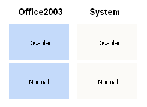
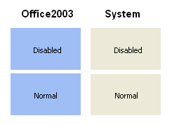

# KryptonPanel

 

Use the *KryptonPanel* control when you need to provide an identifiable area for
other controls. For example, you can use the panels to subdivide a form into
distinct areas. Moving the panel will cause all the contained controls to also
be moved along with it as it acts as a container. This control is similar to the
*KryptonGroup* except it provides only a background and whereas the
*KryptonGroup* also draws a border.

 

The *KryptonPanel* is more suited towards providing the background for large
sections of the client area. *KryptonGroup* is more suitable for grouping a
small number of related controls together.

 

**Appearance** 

The *PanelBackStyle* property is used to define the top level styling required
for the background appearance of the *KryptonPanel* control. The default value
of *PanelClient* gives a background appropriate for use filling the client area
of a form. Alternatively use the *PanelAlternate* setting for a panel that needs
to stand out. See figures 1 and 2 for examples of the visual difference. There
is also a custom style that can be defined via a *KryptonPalette* for situations
where you need to create a variation on the styles already provided. The custom
style is called simply *Custom1*.

 

**Two States** 

Only two possible states of *Disabled* and *Normal* are used by the panel
control. In order to customize the appearance use the corresponding
*StateDisabled* and *StateNormal* properties. Note that only the background
characteristics can be modified as the panel control never has a border or
content.

 

To speed up the customization process an extra *StateCommon* property has been
provided. The settings from this are used if no override has been defined for
the state specific entry. Note that the specific state values always take
precedence and so if you define the background color in *StateNormal* and
*StateCommon* then the *StateNormal* value will be used whenever the control is
in the *Normal* state. Only if the *StateNormal* value is not overridden will it
look in *StateCommon*.

 

**Examples of Appearance** 

Figure 1 shows the appearance when the default *PanelBackStyle* of *ClientPanel*
is used. You can see that the *Disabled* and *Normal* states have the same
appearance. This is true for all the *PanelBackStyle* values as the panel does
not give any visual indication of the enabled state of the control. If you need
to show the panel is disabled then you can alter the *StateDisabled* property as
required. Figure 2 shows *PanelBackStyle* with a value of *PanelAlternate*.

*Figure 1 – PanelBackStyle = PanelClient*

*Figure 2 – PanelBackStyle = PanelAlternate*
