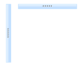

# KryptonSeparator

 

This simple control is used to display an area separator that can act as a
splitter. Press down with the left mouse button and then start dragging and an
overlay will be shown indicating where the separator will move if you release
the mouse at that position. This is ideal for use between controls that you want
the user to be able to resize easily. The *KryptonSeparator* itself does
not perform the resizing of the sibling controls but instead generates events
that you can hook into and use to perform the appropriate change yourself.

 

**Appearance** 

The *SeparatorStyle* property is used to define the styling required for the
*KryptonSeparator* control. The most commonly used styles are *HighProfile* and
*LowProfile*. *HighProfile* will shown a visual representation of a splitter
with a handle so that users can easily see that they should drag the area to
change relative sizing. *LowProfile* should be used when you want the background
style to show through as defined by the *ContainerBackStyle* property.

 

You can use the *Orientation* property to control the drawing direction of the
separator. The default setting of *Vertical* shows the content drawn as if the
separator is used between two horizontal items and the separator is a
thin splitter with a high vertical size but slim horizontal size. Specify
*Horizontal* to have the control in the opposite orientation. See figure 1 for
examples.

*Figure 1 – Orientation Property*

 
**Four States**

The separator control has four possible states, *Disabled*, *Normal*, *Tracking*
and *Pressed*. If the control has been disabled because the *Enabled* property
is defined as *False* then the separator will be in the *Disabled* state.

 

When enabled the separator will be in the *Normal* state until the user moves
the mouse over the splitter area at which point it enters the *Tracking* state.
If the user presses the left mouse button whilst over the control then it enters
the *Pressed* state. In order to customize the appearance of the control in each
of the four states you can use the properties *StateDisabled*, *StateNormal*,
*StateTracking* and *StatePressed*. Each of these properties allows you to
modify the background of the control and the background, border and padding of
the inner splitter element.

 

**Common State** 

To speed up the customization process an extra *StateCommon* property has been
provided. The settings from this are used if no override has been defined for
the state specific entry. Note that the specific state values always take
precedence and so if you define the background color in *StateNormal* and
*StateCommon* then the *StateNormal* value will be used whenever the control is
in the *Normal* state. Only if the *StateNormal* value is not overridden will it
look in *StateCommon*.

  
**Examples of Appearance**

Figure 2 shows the control appearance and the mouse cursor during a dragging
operation. The top image has the separator without the mouse over the control.
Next image down is the display when the mouse moves over the separator and you
can see the cursor has been updated to indicate the dragging is possible. Last
is the display you see whilst the mouse is pressed and being dragged, you can
see the black box that provides feedback on the change that will occur if the
mouse is released in that position.

*Figure 2 – Example appearance during operation*

**Events**

*SplitterMoveRect*  
This event is fired when the use presses down on the separator and is sent to
request the size of the area that the splitter is allowed to be moved. You
should update the *MoveRect* property of the event arguments to set the bounding
box that the splitter indication is allowed to be moved to. You can cancel this
event if you decide the action should not be allowed.

*SplitterMoving*  
As the mouse is moved during the drag this event is fired to inform you of the
new position.

*SplitterMoved*

*SplitterNotMoved*  
When the drag operation completes with success the *SplitterMoved* is fired so
you can perform what resizing operation is appropriate. If the drag operation is
abandoned the *SplitterNotMoved* is fired instead so you can cleanup any actions
you performed in the *SplitterMoveRect*.
