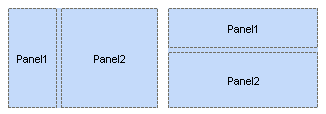

# KryptonSplitContainer

 

Use the *KryptonSplitContainer* to control the sizing of two panels. A movable
bar sits between the two panels and allows the user to change the relative
spacing. You can create complex user interfaces by nesting controls within each
of the two panels. The panels are derived from the *KryptonPanel* control.

 

**Appearance** 

The *ContainerBackStyle* property is used to define the top level styling
required for the background of the container that excludes the splitter area.
Use the *SeparatorStyle* property to alter the styling of the splitter area.
Under normal circumstances the *ContainerBackStyle* will not have any visual
affect because the two panels are positioned over the affected area. Only if the
panels are modified to have a transparent background will this styling property
become useful.

 

You can access the two panel instances directly by using the *Panel1* and
*Panel2* properties. At design time you can drag and drop controls directly onto
the panels in order to setup the required appearance.

 

Use the *Orientation* property to alter the splitter from working in a vertical
to horizontal manner. See figure 1 for an example of the difference as seen at
design time.

*Figure 1 – Vertical and Horizontal orientation*

 

 

**Layout** 

*FixedPanel* can be used to indicate that one of the panels should remain a
constant size and only the other panel should be resized when the split
container is resized. Otherwise the default is to resize both panels to maintain
the same relative sizes. *IsSplitterFixed* is *False* by default and so allows
the user to drag the splitter in order to alter the relative sizes of the
panels. Set this to *True* in order to prevent the user from making any change.

 

To enforce a minimum size use the *Panel1MinSize* and *Panel2MinSize*
properties. This is useful in preventing the user from resizing a panel down to
zero or very small sizes that would be inappropriate in your application. To
hide one of the panels from display use *Panel1Collapsed* or *Panel2Collapsed*
as required. When a panel is collapsed the other panel will automatically take
up the entire split container area and the splitter removed from view.

 

*SplitterDistance* is the number of pixels from the left or top of the split
container that the splitter should be positioned. When the *Orientation* is
vertical the distance is from the left and when horizontal the distance is
measured from the top. *SplitterWidth* is the pixel thickness of the splitter
area. *SplitterIncrement* is pixel multiple used for moving the splitter
position. So an increment of 10 pixels would mean the user can only move the
splitter in 10 pixel increments from the current position.

 

**Events** 

When the splitter position is being moved the *SplitterMoving* event is
generated and allows the change to be cancelled. Once the move has been
completed the *SplitterMoved* event is fired.

 

**Four States** 

The split container can be in one of four possible states, *Disabled*, *Normal*,
*Tracking* and *Pressed*. If the control has been disabled because the *Enabled*
property is defined as *False* then the button will be in the *Disabled* state.

 

When enabled the split container will be in the *Normal* state until the user
moves the mouse over the splitter area at which point it enters the *Tracking*
state. If the user presses the left mouse button whilst over the splitter then
it enters the *Pressed* state.

 

In order to customize the appearance of the control in each of the four states
you can use the properties *StateDisabled*, *StateNormal*, *StateTracking* and
*StatePressed*. Each of these properties allows you to modify the background of
the split container and then background and border of the splitter area.

 

**Common State** 

To speed up the customization process an extra *StateCommon* property has been
provided. The settings from this are used if no override has been defined for
the state specific entry. Note that the specific state values always take
precedence and so if you define the background color in *StateNormal* and
*StateCommon* then the *StateNormal* value will be used whenever the control is
in the *Normal* state. Only if the *StateNormal* value is not overridden will it
look in *StateCommon*.

 

Imagine the following scenario; you would like to define the background of the
splitter area to be always red. Without the *StateCommon* property you would
need to update the same setting in each of *StateDisabled*, *StateNormal*,
*StateTracking* and *StatePressed* properties. Instead you can define the
setting in just *StateCommon* and know they will be used whichever of the four
appearance states the button happens to be using.
