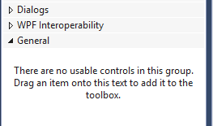

# Using Krypton in Visual Studio 2022
The older version of Krypton used to force you to go through the steps of adding certain files to the GAC. This proved on many occasions to be misleading, and if the release cycle is more than once a year, very disruptive (Especially if working on more than one CLR targeted version).

What is recommended for 2017 onwards, is to add the Krypton files directly to the visual studio's toolbox for each solution you are working on.

If you replace (upgrade etc.) the Kyrpton dll's then just simply re-add the new location to the toolbox.

*Figure 1 - ToolBox Start*

 ### Initially the toolbox will be empty
If the form does not allow a designer to directly access Krypton Controls, then it means that the:
- Toolbox is empty.  (*Figure 1*)
- A different version of CLR is expected.

### Locate and Drag
The steps to add the Krypton Toolkit controls to the designer a simple once done a few times:
- Open the VS2017 Toolkit and pin
- Open "Windows file explorer" and locate the krypton Toolkit dll's
- Drag the toolkit dll's you wish to use over the "General" area and drop
- Right click on the General tab and "Sort Items Alphabetically"
- Right click again and rename to whatever you want (e.g. "Krypton tools").

### Adding Krypton References to your project
- Open the project "References"
- Locate and Add the Krypton dlls via "Browse" or add the last ones used

## Older versions of Krypton (Pre 2018-06)
- Always include the Krypton Designer DLL (Does not need to be shipped - just included for the VS2017 to perform direct design tasks) 
