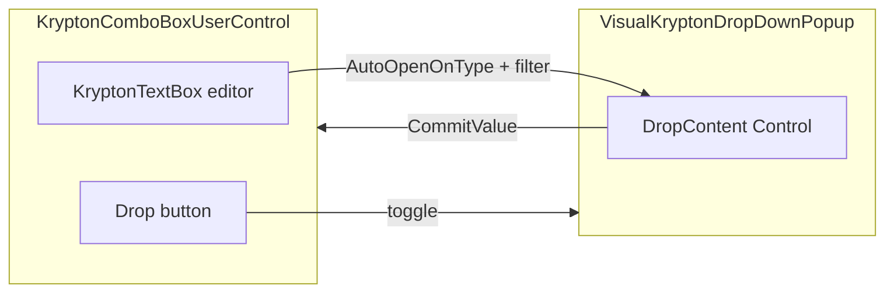

# KryptonComboBoxUserControl

This document describes the **KryptonComboBoxUserControl** feature introduced for [GitHub issue #3443](https://github.com/Krypton-Suite/Standard-Toolkit/issues/3443): a WinForms control that looks and behaves like a combo box, but hosts **any** `Control` (typically a `UserControl`) in its drop-down instead of a fixed list.

**Assembly / namespace:** `Krypton.Utilities` · `Krypton.Utilities`

---

## 1. Purpose and mental model

- The control **derives from `KryptonTextBox`**. You get the same theming, palette, cue hints, button specs, and text-editing surface as other Krypton text inputs.
- A **drop-down button** (`ButtonSpec` with drop-down style) sits on the right. Clicking it toggles the popup.
- The **popup** is a Krypton-styled `VisualPopup` that wraps your `DropContent` with a border and participates in the global popup manager (click-outside dismisses tracking, and so on).
- **Values** are not limited to strings: the host exposes `SelectedValue` (`object`) while `Text` remains the display string in the editor.



---

## 2. Class overview

| Type | Role |
|------|------|
| `KryptonComboBoxUserControl` | Host control: text box + drop button + popup lifecycle. |
| `IKryptonDropDownUserControl` | Optional contract on `DropContent` for size, lifecycle, commit/cancel. |
| `IKryptonDropDownFilterable` | Optional contract for filter-as-you-type with keyboard routing. |
| `KryptonDropDownCommitEventArgs` | Payload for committing a value and optional editor text. |
| `KryptonDropDownOpeningEventArgs` | Cancelable notification before the popup is created. |

**Internal (not extensible):** `VisualKryptonDropDownPopup` hosts the chrome, resize grip, and wires `CommitValue` / `RequestClose` from contract implementations.

---

## 3. Inherited behavior (`KryptonTextBox`)

Because the host is a `KryptonTextBox`, you can use inherited members such as:

- **`Text`**, **`ReadOnly`** — Note: use **`ReadOnlyEditor`** when you want *DropDownList*-style behavior; it sets **`ReadOnly`** for you (see §5).
- **`AutoCompleteMode` / `AutoCompleteSource`** — Disabled by default in the constructor (`None`) so they do not fight custom drop-down semantics; you may re-enable if needed.
- **`ButtonSpecs`**, **`AllowButtonSpecToolTips`**, palette and style properties (`PaletteMode`, `InputControlStyle`, etc.).
- **`CueHint`** — Useful for filter scenarios (see demo: “Start typing a city name…”).

Default designer metadata: **`DefaultEvent`**: `ValueCommitted` · **`DefaultProperty`**: `Text` · **`DefaultBindingProperty`**: `Text`.

---

## 4. `KryptonComboBoxUserControl` — public API

### 4.1 Properties

| Property | Summary |
|---------|---------|
| `DropContent` | `Control?` — Content shown inside the popup. Assign any control; implementing `IKryptonDropDownUserControl` enables sizing and commit wiring. Serialized at design time. Custom **property editor** picks existing controls or creates new `UserControl` instances (§9). |
| `DropDownAlign` | `LeftRightAlignment` — Horizontal alignment of the popup relative to the editor (`Left` default). |
| `DropDownWidth` | `int` — Default **200**. Used when preferred size from the contract is not returned (§6). Minimum stored width is **1**. |
| `DropDownHeight` | `int` — Default **200**. Same rules as width. |
| `MinDropDownSize` | `Size` — When non-empty, popup size is **clamped up** to this minimum when showing and when resizing is enabled. |
| `MaxDropDownSize` | `Size` — When non-empty, size is **clamped down**. |
| `DropDownResizable` | `bool` — **`false`** by default. When **true**, a standard size grip appears; min/max constraints apply. |
| `ReadOnlyEditor` | `bool` — **`false`** default. Mirrors **ComboBoxStyle.DropDownList**: user selects via drop-down only; sets **`ReadOnly`** on the base text box. |
| `AutoOpenOnType` | `bool` — **`false`** default. Opens the popup as the user types and forwards text to **`IKryptonDropDownFilterable.ApplyFilter`** (§7). |
| `MinFilterLength` | `int` — **`1`** default. Threshold character count before auto-open triggers; **`0`** is allowed. If text drops below threshold, popup opened for filtering **closes**. |
| `SelectedValue` | `object?`, read-only — Last value from **`CommitValue`** / **`ValueCommitted`**. Hidden from designer serialization. |
| `IsDroppedDown` | `bool`, read-only — Whether the popup exists with a created handle and is not disposed. |
| `DropButton` | `ButtonSpecAny` — The drop arrow; customize image, tooltip, etc. Hidden from serialization. |

**Popup width rule:** When resolving size, if the computed width is **narrower than the editor’s `Width`**, it is expanded to **`Width`** so the popup never appears thinner than its anchor control.

Changing **`DropContent`** while dropped down closes the popup first.

### 4.2 Methods

| Method | Behavior |
|--------|----------|
| `ShowDropDown()` | Equivalent to **`ShowDropDown(retainEditorFocus: false)`**. No-op when `DropContent` is null, already dropped down, **`DesignMode`**, or handle not created. |
| `ShowDropDown(bool retainEditorFocus)` | Runs **`DropDownOpening`** (cancelable). Builds `VisualKryptonDropDownPopup` with current palette renderer (falls back if palette throws). Anchors popup below the control (or above / clamped to work area — see §8). If **`retainEditorFocus`** is **true**, focus is programmatically moved back to the editor after open (used for **`AutoOpenOnType`**). |
| `CloseDropDown()` | Ends popup tracking if the popup exists. Always safe to call. |

### 4.3 Events

| Event | When |
|-------|------|
| `DropDownOpening` | Before the popup is created; **`Cancel`** on `KryptonDropDownOpeningEventArgs` prevents opening. Exposes **`DropContent`**. |
| `DropDownOpened` | After the popup has been shown. |
| `DropDownClosed` | After the popup is disposed (commit, cancel, click-outside, **Escape**, etc.). |
| `ValueCommitted` | After drop content commits: updates **`SelectedValue`**, optionally **`Text`** from **`DisplayText`**, then raises this event. |

**Protected overrides:** `OnDropDownOpening`, `OnDropDownOpened`, `OnDropDownClosed`, `OnValueCommitted` — follow standard WinForms override patterns.

---

## 5. Keyboard and interaction summary

Handled on the **editor** (`KeyDown`):

| Input | Behavior |
|-------|----------|
| **F4** (no modifiers) | Toggles popup. |
| **Alt+Down** | Opens if closed. |
| **Alt+Up** | Closes if open. |
| **Escape** | Closes if open (**does not** automatically raise `RequestClose` on content — popup simply closes via manager). |

When **`IsDroppedDown`** and **`DropContent`** implements **`IKryptonDropDownFilterable`**, navigation is forwarded **while focus remains on the editor**:

| Key | Action |
|-----|--------|
| **Down** | `NavigateSelection(+1)` |
| **Up** | `NavigateSelection(-1)` |
| **Enter** | `CommitSelection()` if it returns **`true`** (handled/suppressed). |

Inside the popup, `VisualKryptonDropDownPopup` sets **`KeyboardInert`** so child controls can consume keys; **`AllowBecomeActiveWhenCurrent`** is **true** so trees, grids, and lists can take focus when appropriate.

---

## 6. `IKryptonDropDownUserControl`

Implement on your `DropContent` type when you want explicit control over **size**, **lifecycle**, and **commits**.

### Methods

| Member | Contract |
|--------|----------|
| `Size GetPreferredDropSize(Size proposedSize)` | Return **`Size.Empty`** to use host **`DropDownWidth`/`Height`** (after merging with proposed). Non-empty replaces the popup’s initial dimensions (still subject to “at least editor width” rule on the host). |
| `void OnDropDownOpening(object owner)` | Prepare data before show. **`owner`** is the `KryptonComboBoxUserControl` instance (boxed as **`object`** in signature). |
| `void OnDropDownOpened(object owner)` | After show — e.g. focus a child **`TreeView`**. For filter UX, intentionally **do nothing** here if the editor must keep focus (**`AutoOpenOnType`**). |
| `void OnDropDownClosing(object owner, ref bool cancel)` | Set **`cancel = true`** to **keep** the popup open when the popup is closing through the **`CloseInternal`** path (successful commit clears **`KeepOpen`**, **`RequestClose`**, validation). |
| `void OnDropDownClosed(object owner)` | Always invoked from the popup **`Dispose`** when the contract was used — including dismissals like **click outside**, so cleanup is reliable. |

### Events (raise from drop content)

| Event | Use |
|-------|-----|
| `CommitValue` | Raised with **`KryptonDropDownCommitEventArgs`**. Listener updates **`SelectedValue`**, **`Text`** (when **`DisplayText` != null`), and respects **`KeepOpen`**. |
| `RequestClose` | Close popup **without** commit (e.g. **Escape** inside focused content — see demo tree/grid). |

**Important:** Popup **detach** semantics: hosted controls are **`Controls.Remove`'d** but **not disposed** so the host can reuse the **same instance** across opens.

---

## 7. `IKryptonDropDownFilterable`

Use together with **`AutoOpenOnType = true`** on the host.

| Method | Contract |
|--------|----------|
| `bool ApplyFilter(string text)` | Host calls this whenever filter text changes. Return **`false`** when **no** matches — host **closes** the popup if open. Return **`true`** to keep open. |
| `void NavigateSelection(int direction)` | **`+1`** = next (**Down**), **`-1`** = previous (**Up**). |
| `bool CommitSelection()` | Commit current logical selection; implementation should raise **`CommitValue`** when applicable. Return whether a commit occurred; host uses this for **Enter** handling. |

**Typical pattern:** implement **both** `IKryptonDropDownUserControl` and `IKryptonDropDownFilterable` on the same `UserControl` (see **`CityFilterControl`** in the demo).

**Host detail:** When applying committed **`DisplayText`**, the host temporarily sets an internal flag so **`AutoOpenOnType`** does not immediately reopen the popup.

---

## 8. `KryptonDropDownCommitEventArgs`

| Member | Purpose |
|--------|---------|
| `Value` | `object?` — Domain value (row object, path, ID, …). |
| `DisplayText` | `string?` — If **non-null**, host assigns **`Text`** and moves caret to end. If **null**, editor text is **unchanged**. |
| `KeepOpen` | **`false`** default. If **true**, popup **stays open** after commit (rare scenarios such as multi-select or successive picks). |

---

## 9. Design-time experience

### 9.1 Designer (`KryptonComboBoxUserControlDesigner`)

- **Smart tag** (**`KryptonComboBoxUserControlActionList`**): Alignment, Width, Height, Resizable, Read-only editor, `InputControlStyle`, `PaletteMode`.
- **`ButtonSpecs`** participate in **`AssociatedComponents`** so copy/paste and selection behave coherently.
- **Height resize** locked at design time (horizontal sizing only — matches Krypton combo/text conventions).

Note: **`AutoOpenOnType`** and **`MinFilterLength`** are not currently on the smart tag; set them in the **Properties** grid.

### 9.2 `DropContent` property editor (`KryptonDropContentEditor`)

- **“(none)”** clears the reference.
- **Existing controls** on the **same designer host**, excluding **`Form`s**, **`KryptonTextBox`**, and **self**.
- **[New]** list: **`UserControl`**-derived types from **`ITypeDiscoveryService`** (**`excludeGlobalTypes: true`**), with **public parameterless constructor**, not abstract, not open generic. New instances are **`CreateComponent`**’d and **sited** (appear in component tray / code-gen) but are **not** auto-parented to the form — intended for drop-only content.

---

## 10. Runtime popup placement (`VisualKryptonDropDownPopup`)

Not public API, but behavior matters for layout:

- Popup is shown **below** the editor when it fits in the **working area**; otherwise **above**, with further clamping to stay on-screen.
- Horizontal position follows **`DropDownAlign`** (left vs right edge of anchor), then clamped into the working area.
- **`DropDownResizable`:** hit-test maps bottom-right grip to **`HTBOTTOMRIGHT`** for system resizing; **`ControlPaint.DrawSizeGrip`** draws the grip.
- **`DoesCurrentMouseDownEndAllTracking`:** mouse-down on the resize grip does **not** end popup tracking.

---

## 11. Pitfalls and best practices

1. **Commit without contract:** A plain `UserControl` with **no** `IKryptonDropDownUserControl` still displays; you must use **other** means to signal selection (e.g. host listens to child control events) because there is **no** automatic **`ValueCommitted`** from the popup alone.
2. **`RequestClose` only on contract types:** The popup subscribes to **`RequestClose`** only when `DropContent` implements **`IKryptonDropDownUserControl`**.
3. **`OnDropDownClosing`:** Use sparingly; incorrect **`cancel`** handling can fight the popup manager.
4. **Filter + empty results:** Returning **`false`** from **`ApplyFilter`** closes the popup — design list content accordingly.
5. **Focus:** For **`AutoOpenOnType`**, keep **`OnDropDownOpened`** from stealing focus if navigation keys should target the list **through** the host (demo pattern).
6. **Threading:** Standard WinForms — create and interact on the **UI thread**.

---

## 12. Minimal code patterns

### 12.1 Simple host (code)

```csharp
var combo = new KryptonComboBoxUserControl
{
    DropContent = myUserControl,
    DropDownWidth = 280,
    DropDownHeight = 200,
    DropDownResizable = true
};
combo.ValueCommitted += (_, e) =>
{
    // e.Value, e.DisplayText
};
```

### 12.2 Commit from drop content

```csharp
CommitValue?.Invoke(this, new KryptonDropDownCommitEventArgs(
    value: selectedItem,
    displayText: selectedItem.ToString()));
```

### 12.3 Cancel without commit

```csharp
RequestClose?.Invoke(this, EventArgs.Empty);
```

### 12.4 Cancel open from host or external code

```csharp
combo.DropDownOpening += (_, e) =>
{
    if (!IsDataReady)
        e.Cancel = true;
};
```
