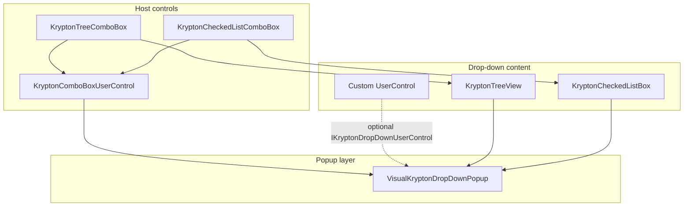

# Krypton Combo Drop-Down Controls

This guide documents the **combo-style drop-down controls** in `Krypton.Toolkit.Utilities` (namespace `Krypton.Toolkit.Utilities`). These controls provide a `KryptonTextBox`-based editor with a Krypton-styled popup that hosts arbitrary or built-in drop-down content.

| GitHub issues | Controls |
|---------------|----------|
| [#3443](https://github.com/Krypton-Suite/Standard-Toolkit/issues/3443) | `KryptonComboBoxUserControl` (extensible host) |
| [#3444](https://github.com/Krypton-Suite/Standard-Toolkit/issues/3444) | `KryptonTreeComboBox` (hierarchical tree picker) |
| — | `KryptonCheckedListComboBox` (multi-select checked list) |

---

## Table of contents

1. [Overview](#overview)
2. [Getting started](#getting-started)
3. [Architecture](#architecture)
4. [Choosing a control](#choosing-a-control)
5. [KryptonComboBoxUserControl](#kryptoncomboboxusercontrol)
6. [Drop-down contracts](#drop-down-contracts)
7. [KryptonTreeComboBox](#kryptontreecombobox)
8. [KryptonCheckedListComboBox](#kryptoncheckedlistcombobox)
9. [Designer support](#designer-support)
10. [Keyboard and mouse interaction](#keyboard-and-mouse-interaction)
11. [Code examples](#code-examples)
12. [Related controls](#related-controls)
13. [TestForm demos](#testform-demos)
14. [Troubleshooting](#troubleshooting)

---

## Overview

Standard `KryptonComboBox` is optimized for a flat list of items. It is not well suited to hosting arbitrary controls (trees, grids, multi-column lists, custom panels) in its drop-down region.

The combo drop-down stack solves that by:

- Using a **`KryptonTextBox` + drop button** as the “combo” chrome (inherits cue hints, palette, button specs, and input styles).
- Showing drop-down content in a **`VisualKryptonDropDownPopup`** (Krypton border, optional resize grip, screen-aware positioning).
- Supporting an optional **`IKryptonDropDownUserControl`** contract so custom `UserControl` content can size itself, receive lifecycle callbacks, and commit values back to the host.
- Supporting an optional **`IKryptonDropDownFilterable`** contract for filter-as-you-type scenarios.

Built-on-top controls (`KryptonTreeComboBox`, `KryptonCheckedListComboBox`) fix the drop-down content and expose a familiar API (`Nodes`, `Items`, etc.) without requiring custom `UserControl` code.

---

## Getting started

### Assembly and namespace

```csharp
using Krypton.Toolkit;
using Krypton.Toolkit.Utilities;
```

| Item | Value |
|------|--------|
| Assembly | `Krypton.Toolkit.Utilities.dll` |
| NuGet (typical) | `Krypton.Standard.Toolkit` (aggregate package) |
| Toolbox | Controls appear under **Krypton.Toolkit.Utilities** after referencing the assembly |

### Minimal example — tree combo

```csharp
var combo = new KryptonTreeComboBox
{
    DropDownWidth = 280,
    DropDownHeight = 240,
    DisplayMode = KryptonTreeComboBoxDisplayMode.Breadcrumb,
    SelectMode = KryptonTreeComboBoxSelectMode.LeafOnly,
    ReadOnlyEditor = true
};

var root = new TreeNode("Europe");
root.Nodes.Add(new TreeNode("Germany") { Tag = "DE" });
root.Nodes.Add(new TreeNode("France") { Tag = "FR" });
combo.Nodes.Add(root);
root.Expand();

combo.SelectedNodeChanged += (_, _) =>
    Debug.WriteLine($"Picked: {combo.Text}, Tag={combo.SelectedValue}");

form.Controls.Add(combo);
```

### Minimal example — checked list combo

```csharp
var combo = new KryptonCheckedListComboBox { Width = 320 };
combo.Items.AddRange(new object[] { "Docking", "Navigator", "Ribbon", "Workspace" });
combo.SetItemChecked(0, true);
combo.SetItemChecked(2, true);
combo.RefreshCheckedSummary(); // required after SetItemChecked before a handle exists

combo.CheckedItemsChanged += (_, _) =>
    Debug.WriteLine($"Checked: {string.Join(", ", combo.GetCheckedValues())}");

form.Controls.Add(combo);
```

---

## Architecture



**Inheritance**

```
KryptonTextBox
    └── KryptonComboBoxUserControl          ← extensible host (#3443)
            ├── KryptonTreeComboBox         ← fixed tree drop-down (#3444)
            └── KryptonCheckedListComboBox  ← fixed checked-list drop-down
```

**Commit flow**

1. User interacts with drop-down content.
2. Content raises `CommitValue` (`IKryptonDropDownUserControl`) with `KryptonDropDownCommitEventArgs`.
3. Popup forwards to host `ValueCommitted`.
4. Host updates `SelectedValue` and `Text` (unless `DisplayText` is null).
5. Popup closes unless `KeepOpen == true`.

---

## Choosing a control

| Need | Control |
|------|---------|
| Custom panel, grid, chart, or proprietary picker | `KryptonComboBoxUserControl` + your `UserControl` |
| Grouped / hierarchical single selection (folders, categories, locations) | `KryptonTreeComboBox` |
| Multi-select from a flat list with check boxes | `KryptonCheckedListComboBox` |
| Multi-select with legacy checkbox-item list and data binding | `KryptonCheckBoxComboBox` (older stack; see [Related controls](#related-controls)) |
| Filter-as-you-type over a custom list | `KryptonComboBoxUserControl` + `IKryptonDropDownFilterable` |

---

## KryptonComboBoxUserControl

**Type:** `Krypton.Toolkit.Utilities.KryptonComboBoxUserControl`  
**Base class:** `Krypton.Toolkit.KryptonTextBox`  
**Default event:** `ValueCommitted`  
**Default property:** `Text`

A combo-style editor whose drop-down hosts any `Control`, typically a `UserControl` assigned to `DropContent`.

### Features

- Krypton-themed popup anchored below (or above) the editor, with optional **resize grip** (`DropDownResizable`).
- **Horizontal alignment** of popup (`DropDownAlign`: left or right relative to editor).
- **Min/max popup size** (`MinDropDownSize`, `MaxDropDownSize`).
- **Read-only editor** mode (`ReadOnlyEditor`) mimicking `ComboBoxStyle.DropDownList`.
- **Filter-as-you-type** (`AutoOpenOnType`, `MinFilterLength`) when drop content implements `IKryptonDropDownFilterable`.
- Inherits all `KryptonTextBox` features: cue hint, palette modes, button specs, etc.
- Drop button exposed via `DropButton` (`ButtonSpecAny`) for customization.

### Properties

| Property | Type | Default | Description |
|----------|------|---------|-------------|
| `DropContent` | `Control?` | `null` | Control shown in the popup. Use `KryptonDropContentEditor` in the designer. |
| `DropDownAlign` | `LeftRightAlignment` | `Left` | Horizontal alignment of popup vs. editor. |
| `DropDownWidth` | `int` | `200` | Initial popup width (px). May be overridden by `GetPreferredDropSize`. |
| `DropDownHeight` | `int` | `200` | Initial popup height (px). |
| `MinDropDownSize` | `Size` | `Empty` | Minimum size when resizing; `Empty` disables minimum. |
| `MaxDropDownSize` | `Size` | `Empty` | Maximum size when resizing; `Empty` disables maximum. |
| `DropDownResizable` | `bool` | `false` | Shows bottom-right resize grip on popup. |
| `ReadOnlyEditor` | `bool` | `false` | When true, user cannot type in editor (`ReadOnly` synced). |
| `AutoOpenOnType` | `bool` | `false` | Opens popup while typing; forwards text to `IKryptonDropDownFilterable`. |
| `MinFilterLength` | `int` | `1` | Minimum characters before `AutoOpenOnType` opens popup. |
| `SelectedValue` | `object?` | — | Last committed value (read-only). |
| `IsDroppedDown` | `bool` | — | Whether popup is open (read-only). |
| `DropButton` | `ButtonSpecAny` | — | Drop-down button spec (read-only). |
| `Text` | `string` | — | Editor display text (inherited; updated on commit). |

Also inherits `KryptonTextBox` properties: `InputControlStyle`, `PaletteMode`, `CueHint`, `ButtonSpecs`, etc.

### Methods

| Method | Description |
|--------|-------------|
| `ShowDropDown()` | Opens popup; focus moves to drop content. |
| `ShowDropDown(bool retainEditorFocus)` | Opens popup; when `true`, focus returns to editor (filter-as-you-type). |
| `CloseDropDown()` | Closes popup if open. |

### Events

| Event | Args | Description |
|-------|------|-------------|
| `DropDownOpening` | `KryptonDropDownOpeningEventArgs` | Before popup shows; set `Cancel = true` to block. |
| `DropDownOpened` | `EventArgs` | After popup is visible. |
| `DropDownClosed` | `EventArgs` | After popup is dismissed. |
| `ValueCommitted` | `KryptonDropDownCommitEventArgs` | Drop content committed a value. |

---

## Drop-down contracts

### IKryptonDropDownUserControl

Optional interface for `DropContent`. Implement on your `UserControl` when you need sizing, lifecycle hooks, or value commit.

```csharp
public interface IKryptonDropDownUserControl
{
    Size GetPreferredDropSize(Size proposedSize);
    void OnDropDownOpening(object owner);
    void OnDropDownOpened(object owner);
    void OnDropDownClosing(object owner, ref bool cancel);
    void OnDropDownClosed(object owner);

    event EventHandler<KryptonDropDownCommitEventArgs> CommitValue;
    event EventHandler RequestClose;
}
```

| Member | Purpose |
|--------|---------|
| `GetPreferredDropSize` | Return preferred popup size, or `Size.Empty` to use host `DropDownWidth`/`DropDownHeight`. Width is clamped to at least editor width. |
| `OnDropDownOpening` | Refresh data, sync selection before show. |
| `OnDropDownOpened` | Set focus to inner control. |
| `OnDropDownClosing` | Set `cancel = true` to keep popup open. |
| `OnDropDownClosed` | Cleanup after dismiss. |
| `CommitValue` | Raise when user picks a value; host updates `Text`/`SelectedValue`. |
| `RequestClose` | Raise to close without commit (e.g. Escape in content). |

**Commit example**

```csharp
CommitValue?.Invoke(this, new KryptonDropDownCommitEventArgs(
    value: selectedObject,
    displayText: selectedObject.ToString()));
```

**Keep popup open** (multi-step or live update):

```csharp
CommitValue?.Invoke(this, new KryptonDropDownCommitEventArgs(values, summary)
{
    KeepOpen = true
});
```

### IKryptonDropDownFilterable

Optional interface for filter-as-you-type when `AutoOpenOnType = true`.

```csharp
public interface IKryptonDropDownFilterable
{
    bool ApplyFilter(string text);
    void NavigateSelection(int direction);  // +1 down, -1 up
    bool CommitSelection();
}
```

Host behavior:

- Opens popup with `ShowDropDown(retainEditorFocus: true)` so typing continues in editor.
- Calls `ApplyFilter(Text)` on each text change; closes popup if filter returns `false`.
- Forwards **Up/Down/Enter** to `NavigateSelection` / `CommitSelection` while popup is open.

### KryptonDropDownCommitEventArgs

| Property | Description |
|----------|-------------|
| `Value` | Committed object (stored in `SelectedValue`). |
| `DisplayText` | Text written to editor; `null` leaves `Text` unchanged. |
| `KeepOpen` | When `true`, popup stays open after commit (default `false`). |

### KryptonDropDownOpeningEventArgs

Inherits `CancelEventArgs`. Exposes `DropContent` (the control about to be shown).

---

## KryptonTreeComboBox

**Type:** `Krypton.Toolkit.Utilities.KryptonTreeComboBox`  
**Base class:** `KryptonComboBoxUserControl`  
**Default event:** `SelectedNodeChanged`  
**Default property:** `Nodes`  
**Issue:** [#3444](https://github.com/Krypton-Suite/Standard-Toolkit/issues/3444)

Single-select combo with a hierarchical `KryptonTreeView` in the drop-down. Supports grouping (parent nodes), optional check boxes and images on nodes, and multiple ways to format the editor text after selection.

### Features

- **Leaf-only or any-node** selection (`SelectMode`).
- **Display modes:** leaf text only, full path, or breadcrumb trail.
- Commit via **double-click**, **Enter**, or optional **single-click** (`CommitOnNodeClick`).
- Forwards `AfterSelect` while drop-down is open.
- `CheckBoxes`, `ImageList`, `ShowLines`, `ShowRootLines`, `ShowPlusMinus` forwarded to inner tree.
- `ReadOnlyEditor = true` by default; `DropDownResizable = true` by default.
- Does **not** support `AutoOpenOnType` (property hidden).

### Properties (in addition to host)

| Property | Type | Default | Description |
|----------|------|---------|-------------|
| `Nodes` | `TreeNodeCollection` | — | Tree nodes (designer collection editor). |
| `SelectedNode` | `TreeNode?` | — | Current selection; updates `Text` when set. |
| `SelectedValue` | `object?` | — | Committed node reference (from last commit). |
| `DisplayMode` | `KryptonTreeComboBoxDisplayMode` | `LeafText` | How editor text is formatted. |
| `SelectMode` | `KryptonTreeComboBoxSelectMode` | `LeafOnly` | `LeafOnly` or `AnyNode`. |
| `PathSeparator` | `string` | `\` | Separator for `FullPath` mode. |
| `BreadcrumbSeparator` | `string` | ` > ` | Separator for `Breadcrumb` mode. |
| `CommitOnNodeClick` | `bool` | `false` | Single-click commits selectable nodes. |
| `CheckBoxes` | `bool` | `false` | Show node check boxes (visual only for single-select commit). |
| `ImageList` | `ImageList?` | `null` | Node images. |
| `ShowLines` | `bool` | `true` | Tree line styling. |
| `ShowRootLines` | `bool` | `true` | Lines from root. |
| `ShowPlusMinus` | `bool` | `true` | Expand/collapse glyphs. |
| `TreeView` | `KryptonTreeView` | — | Inner tree (do not reparent). |

Inherited from host: `DropDownWidth` (default 280), `DropDownHeight` (default 240), `DropDownResizable`, `DropDownAlign`, `ReadOnlyEditor`, palette/style properties.

### Enums

**KryptonTreeComboBoxDisplayMode**

| Value | Editor text example |
|-------|---------------------|
| `LeafText` | `Germany` |
| `FullPath` | `Continents\Europe\Germany` (uses `PathSeparator`) |
| `Breadcrumb` | `Continents > Europe > Germany` (uses `BreadcrumbSeparator`) |

**KryptonTreeComboBoxSelectMode**

| Value | Behavior |
|-------|----------|
| `LeafOnly` | Only nodes without children can be committed. |
| `AnyNode` | Parent/group nodes can be committed. |

### Methods

| Method | Description |
|--------|-------------|
| `CanSelectNode(TreeNode node)` | Whether node is committable for current `SelectMode`. |
| `FormatNodeDisplay(TreeNode node)` | Format node text per `DisplayMode`. |

### Events

| Event | Description |
|-------|-------------|
| `SelectedNodeChanged` | After a node is committed from the drop-down. |
| `AfterSelect` | Forwards inner `KryptonTreeView.AfterSelect` while popup is open. |
| `ValueCommitted` | Inherited; `Value` is the `TreeNode`, `DisplayText` is formatted text. |

---

## KryptonCheckedListComboBox

**Type:** `Krypton.Toolkit.Utilities.KryptonCheckedListComboBox`  
**Base class:** `KryptonComboBoxUserControl`  
**Default event:** `ItemCheck`  
**Default property:** `Items`

Multi-select combo with a `KryptonCheckedListBox` hosted **directly** in the popup (not inside a plain `UserControl` wrapper) so Krypton layout and painting work correctly.

### Features

- **Live summary** in editor while checking/unchecking (popup stays open).
- Configurable **separator** between checked item names in editor.
- **Empty selection text** when nothing is checked.
- **Enter closes popup** optionally (`CloseDropDownOnEnter`, default `true`).
- `CheckOnClick` forwarded to inner list (default `true`).
- `ReadOnlyEditor = true` by default; `DropDownResizable = true` by default.
- Does **not** support `AutoOpenOnType` (property hidden).

### Properties (in addition to host)

| Property | Type | Default | Description |
|----------|------|---------|-------------|
| `Items` | `ListBox.ObjectCollection` | — | List entries (designer string collection editor). |
| `CheckedItems` | `CheckedItemCollection` | — | Currently checked items. |
| `CheckedIndices` | `CheckedIndexCollection` | — | Indexes of checked items. |
| `CheckedListBox` | `KryptonCheckedListBox` | — | Inner list (do not reparent). |
| `ValueSeparator` | `string` | `", "` | Between item texts in editor summary. |
| `EmptySelectionText` | `string` | `""` | Editor text when no checks. |
| `CloseDropDownOnEnter` | `bool` | `true` | Enter in list closes popup. |
| `CheckOnClick` | `bool` | `true` | Toggle check on item click. |
| `SelectedValue` | `object[]` | — | Last committed checked values (via `GetCheckedValues()`). |

Inherited from host: `DropDownWidth` (default 260), `DropDownHeight` (default 200), `DropDownResizable`, `DropDownAlign`, palette/style properties.

### Methods

| Method | Description |
|--------|-------------|
| `GetItemChecked(int index)` | Check state of item. |
| `SetItemChecked(int index, bool value)` | Set checked state. |
| `GetItemCheckState(int index)` | `CheckState` of item. |
| `SetItemCheckState(int index, CheckState value)` | Set `CheckState`. |
| `ClearChecked()` | Uncheck all items. |
| `GetCheckedValues()` | `object[]` of checked items. |
| `FormatCheckedItemsDisplay()` | Build summary string for editor. |
| `RefreshCheckedSummary()` | Update editor from checks without opening popup (call after `SetItemChecked` in ctor). |

### Events

| Event | Description |
|-------|-------------|
| `ItemCheck` | Forwards `KryptonCheckedListBox.ItemCheck` (before state changes). |
| `CheckedItemsChanged` | After summary / `SelectedValue` updated. |
| `ValueCommitted` | Inherited; fires on each check change (`KeepOpen`) and on close. |

### Initialization note

`SetItemChecked` during form/control construction may run **before** a window handle exists. The control skips deferred `BeginInvoke` updates in that case. Always call **`RefreshCheckedSummary()`** after programmatically setting checks in the constructor:

```csharp
combo.SetItemChecked(0, true);
combo.SetItemChecked(2, true);
combo.RefreshCheckedSummary();
```

---

## Designer support

### KryptonComboBoxUserControl

- **Smart tag:** Drop-down alignment, width/height, resizable, read-only editor, input style, palette.
- **DropContent editor:** Picks an existing control on the form or creates a new `UserControl`-derived type (sited on the form for code generation).

### KryptonTreeComboBox

- **Smart tag:** Drop-down settings + display mode + select mode + palette.
- **Nodes:** Standard tree node collection editor on `Nodes`.

### KryptonCheckedListComboBox

- **Smart tag:** Drop-down settings + value separator + palette.
- **Items:** Standard list string collection editor.

### Toolbox bitmaps

| Control | Bitmap |
|---------|--------|
| `KryptonComboBoxUserControl` | `KryptonComboBox` |
| `KryptonTreeComboBox` | `KryptonComboBox` |
| `KryptonCheckedListComboBox` | `KryptonCheckedListBox` |

---

## Keyboard and mouse interaction

### Host (all variants)

| Input | Action |
|-------|--------|
| Click drop button | Toggle popup |
| **F4** | Toggle popup |
| **Alt+Down** | Open popup |
| **Alt+Up** | Close popup |
| **Escape** (popup open) | Close popup |

### Tree combo (popup open)

| Input | Action |
|-------|--------|
| **Enter** | Commit selected node (if selectable) |
| **Escape** | Close popup |
| Double-click node | Commit (if selectable) |
| Single-click | Commit when `CommitOnNodeClick` is true |

### Checked list combo (popup open)

| Input | Action |
|-------|--------|
| Click item | Toggle check (`CheckOnClick`) |
| **Enter** | Close when `CloseDropDownOnEnter` is true |
| **Escape** | Close popup |

### Filter-as-you-type (host + `IKryptonDropDownFilterable`)

| Input | Action |
|-------|--------|
| Type in editor | Open popup (if `AutoOpenOnType`), call `ApplyFilter` |
| **Up / Down** | `NavigateSelection` |
| **Enter** | `CommitSelection` |

---

## Code examples

### Custom grid picker (`IKryptonDropDownUserControl`)

See `TestForm/KryptonComboBoxUserControlDemo.cs` — `GridPickerControl` uses `KryptonDataGridView`, commits on double-click/Enter, implements `GetPreferredDropSize`, and raises `CommitValue` with an anonymous type `{ Code, Name, Currency }`.

### Tree with `Tag` for business key

```csharp
var node = new TreeNode("Germany") { Tag = "DE" };
// After commit:
var countryCode = (string)combo.SelectedValue?.Tag!;
```

### Checked list — custom separator and empty text

```csharp
var combo = new KryptonCheckedListComboBox
{
    ValueSeparator = " | ",
    EmptySelectionText = "(none selected)",
    CloseDropDownOnEnter = false  // keep popup open on Enter
};
```

### Cancel opening drop-down

```csharp
combo.DropDownOpening += (_, e) =>
{
    if (!CanShowPickerToday())
        e.Cancel = true;
};
```

---

## Related controls

| Control | Location | Notes |
|---------|----------|-------|
| `KryptonCheckBoxComboBox` | `Krypton.Toolkit.Utilities` | Older multi-select combo; custom checkbox item list on `KryptonPopUpComboBox` stack. Use for existing apps with data-binding to checkbox items. **Prefer `KryptonCheckedListComboBox`** for new work on the #3443 popup stack. |
| `KryptonCheckedListBox` | `Krypton.Toolkit` | Standalone checked list (always visible). |
| `KryptonTreeView` | `Krypton.Toolkit` | Standalone tree. |
| `KryptonComboBox` | `Krypton.Toolkit` | Flat list combo; not for arbitrary drop-down content. |

---

## Troubleshooting

### Blank or gray drop-down (checked list)

**Cause:** `KryptonCheckedListBox` must be hosted as a Krypton control directly in the popup so `ViewLayoutFill` / `OnLayout` can position the inner list. A plain `UserControl` wrapper shows gray chrome with no items.

**Fix:** Use `KryptonCheckedListComboBox` (current implementation). If building custom content, host `KryptonCheckedListBox` as `DropContent` itself or call `ForceControlLayout()` / `PerformNeedPaint` on open.

### `BeginInvoke` / handle not created

**Cause:** Calling `SetItemChecked` in the constructor triggers `ItemCheck` before any control has a handle.

**Fix:** Call `RefreshCheckedSummary()` after programmatic initialization. The drop-down defers live updates until the host has a handle.

### Popup width narrower than editor

**By design:** Popup width is at least the editor width (`ResolvePopupSize` in host).

### Custom content does not close on pick

Implement `IKryptonDropDownUserControl` and raise `CommitValue` with `KeepOpen = false` (default). For multi-select live updates, use `KeepOpen = true`.

### Designer shows `AutoOpenOnType` on tree / checked list combos

Properties are hidden (`Browsable(false)`); specialized combos do not support filter-as-you-type. Use `KryptonComboBoxUserControl` for that scenario.

### Styling / palette mismatch in popup

Ensure drop content uses the same `PaletteMode` as the host, or relies on global palette (`KryptonManager`). `KryptonCheckedListComboBoxDropDown` syncs `PaletteMode` from the owner on open.

---

## Source layout (reference)

```
Krypton.Toolkit.Utilities/
  Components/
    KryptonComboBoxUserControl/
      Controls Toolkit/KryptonComboBoxUserControl.cs
      Controls Visuals/VisualKryptonDropDownPopup.cs
      General/IKryptonDropDownUserControl.cs
      General/IKryptonDropDownFilterable.cs
      EventArgs/KryptonDropDownCommitEventArgs.cs
      EventArgs/KryptonDropDownOpeningEventArgs.cs
      Designers/...
    KryptonTreeComboBox/
      Controls Toolkit/KryptonTreeComboBox.cs
      Controls Visuals/KryptonTreeComboBoxDropDown.cs
      General/KryptonTreeComboBoxDisplayMode.cs
      General/KryptonTreeComboBoxSelectMode.cs
      Designers/...
    KryptonCheckedListComboBox/
      Controls Toolkit/KryptonCheckedListComboBox.cs
      Controls Visuals/KryptonCheckedListComboBoxDropDown.cs
      Designers/...
```
