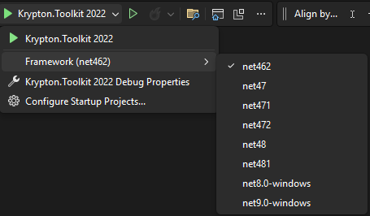

# How To Fix the components in the designer

If you are experiencing issues while using the components in the designer when upgrading from .NET Framework to .NET, you might need to replace  `<TargetFramework>net[##Current-Version##]-windows</TargetFramework>` with the following in your project configuration files.

```xml
    <TargetFrameworks>net481;net[##Current-Version##]-windows</TargetFrameworks>
``` 
More discussion about this topic can be found [here](https://github.com/Krypton-Suite/Standard-Toolkit/discussions/684).

To learn more about the `TargetFrameworks` attribute, [click here](https://docs.microsoft.com/en-us/dotnet/standard/frameworks).

***N.B: This action will produce binaries for multiple frameworks.***

If you do not want to default to a .NET FrameWork build, you can configure your build process in Visual Studio, as shown below.



*Figure 1: Configurable targets* 