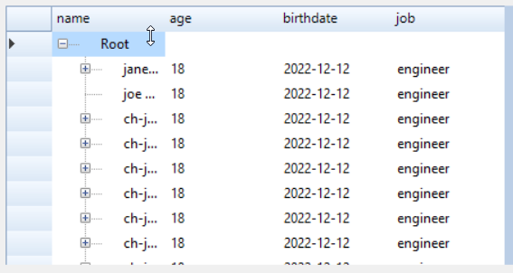

# Krypton TreeGrid View - FAQ

If you are experiencing issues with the Krypton TreeGrid View, a solution might be found in the following article. If you can't find what you are looking for, please raise a [new support ticket](../Reporting%20a%20Issue.md).

### KryptonTreeGridview it shows expand button on every column

A solution has been found by [blackholeearth](https://github.com/blackholeearth). The fix is as follows:-

```cs
  // Example of adding nodes
  
  // Define columns

  //this will show expand/button
  ktgv1.Columns.Add(new KryptonTreeGridColumn { HeaderText = "name", DataPropertyName = "Column1" });  

 //normal column
  ktgv1.Columns.Add(new KryptonDataGridViewTextBoxColumn { HeaderText = "age", DataPropertyName = "Column2" });  
  ktgv1.Columns.Add(new KryptonDataGridViewTextBoxColumn { HeaderText = "birthdate", DataPropertyName = "Column3" }); 
  ktgv1.Columns.Add(new KryptonDataGridViewTextBoxColumn { HeaderText = "job", DataPropertyName = "Column4" }); 
```

Which results in

