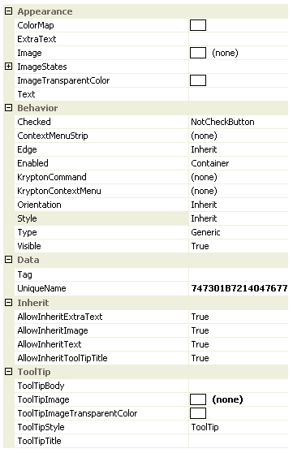
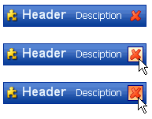
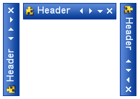
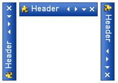

# ButtonSpec

Some *Krypton* controls allow buttons to be specified for display within the
*Krypton* control itself. In the case of the `KryptonHeader` and
`KryptonHeaderGroup` they are displayed in the header portions of the
control. In order to support this capability they expose a collection property
called *ButtonSpecs.* This collection can contain any number of *ButtonSpec*
(Button Specification) instances that describe the button that is required for
display. Figure 1 below shows the *ButtonSpecs* property as it is exposed by the
`KryptonHeader` control.

*Figure 1 - ButtonSpecs property on KryptonHeader*

### ButtonSpec Instances  
On clicking the property button the standard collection editor is displayed as a
modal dialog box. You can then use the collection editor to create and remove
individual *ButtonSpec* instances. On the right side of the collection editor
you will see the properties of the currently selected *ButtonSpec* instance.
Figure 2 shows the properties that are exposed for a *ButtonSpec* instance.

*Figure2 - ButtonSpec properties in collection editor*

To describe the function of the different properties a *KryptonHeader* control
will be used. Figure 3 shows a simple *KryptonHeader *instance that has been
created and currently does not have any *ButtonSpec* instances added.

*Figure 3 - KryptonHeader with no buttons*

### Text, ExtraText, Image, ImageStates and ImageTransparentColor
The *ButtonSpec* exposes the same value properties as a `KryptonButton`
instance. You can assign text for display by setting the *Text* and *ExtraText*
properties. To show an image you use the *Image* property and if you need
per-state images then you can use the properties available as children of
*ImageStates*. If you need to specify which color in the *Image* should be
transparent then use the *ImageTransparentColor* property. Figure 4 shows a red
cross assigned to the *Image* property and all other properties of the
*ButtonSpec* left as default values. At the top of figure 4 is the output when
the mouse is not interacting with the button, the second picture shows the mouse
tracking over the button and finally when the mouse is pressed down.

   *Figure 4 - Button in normal, tracking and pressed states*

If you need to show different images for each of the button states then instead
of using the *Image* property you would assign the different images to the child
properties of *ImageStates*. You would not usually define all of the *Text*,
*ExtraText* and *Image* properties together because of the excessive amount of
space they would occupy but Figure 5 shows that it is possible.

*Figure 5 - ButtonSpec with Image, Text & ExtraText defined*

  
### ToolTipTitle, ToolTipBody, ToolTipImage, ToolTipImageTransparentColor and
ToolTipStyle
These properties are used to specify the tool tip details for display when the
user hovers over the button spec instance. Use the *ToolTipTitle* and
*ToolTipBody* properties to define two text strings for display. To associate an
image with the tool tip you should assign it to *ToolTipImage* and use the
*ToolTipImageTransparentColor* for specifying a color in the image that should
be treated as transparent. For example, many bitmaps will use magenta as a color
for the background area that should become transparent when the bitmap is drawn,
in that case assign Color.Magenta to the
*ToolTipImageTransparentColor* property.

The default value for the *ToolTipStyle* is *LabelStyle.ToolTip* and will cause
the image and title text to be shown at the top of the tool tip area and the
body text to be shown below. Alternatively you could change the style to
*LabelStyle.SuperTip* in which case the title text is shown in bold at the top
of the tool tip area, the image in shown below with the title also below and to
the right of the image.

Notes: 
That by default the *Krypton* controls that allow the definition of button
specification do not show tool tips for them. You must therefore find the
appropriate property such as `AllowButtonSpecTooltips` and set it to `true`
before tool tips will be displayed.

Also, if the parent Item has tooltips, and the button spec has tooltips, then
the default is show both when hovering over the buttonspec. This can be disabled 
by setting `AllowButtonSpecTooltipPriority` to `true`, so that only 1 tooltip is
displayed when hovering over any part of the control.  
  
### Style
By default the button will be displayed using the *ButtonSpec* button style
appearance. Note that the *Standalone* button style is intended for use
with standard buttons within the main application, *LowProfile* is likewise
intended for standalone buttons that need a lower profile. *ButtonSpec, *as the
name indicates,* *is intended for use with button specification scenarios and
has a much smaller padding between the button contents and the border. This is
because space is very constrained in places that a *ButtonSpec* is used and so
the button needs to be kept compact.  
  
If you prefer to change the default *ButtonSpec* button style then just modify
the *Style* property. Figure 6 shows the appearance when the *Style* is altered
to *Standalone*, where a background and border are shown even when the mouse is
not over the button.  
  

*Figure 6 - Style = Button1*

### Edge  
All the examples so far have shown the button placed on the right hand side of
the example *KryptonHeader*. This is the default, *Far*, position but you can
reverse this to have the button shown *Near*. Figure 7 shows the *Edge* property
modified to *Near*.

*Figure 7 - Edge = Near*

### Enabled
The *Enabled* property has three possible values. If you specify *Enabled* as
*True* then the button will be enabled as long as the control itself is also
enabled. Remember that if the *Krypton* control itself has been disabled then
each *ButtonSpec* must be disabled because the user has been prevented from
interacting with the control. If you specify *Enabled* as *False* then the
button is always displayed as disabled as can seen in figure 8.

The third possible *Enabled* property value is *Container*. The need for three
different enabled options is not apparent on a simple control like a
*KryptonHeader* but is required for more complex controls like the
*KryptonNavigator*. The *Container* option acts the same as the *True* setting
for simple controls where the whole control is the container. If the control
(which is also the container) is enabled then so is the *ButtonSpec,* if the
control is disabled then so is the ButtonSpec. Hence the *True* and *Container*
options act in exactly the same way. For the *KryptonNavigator*, and other
complex controls, the container is not the whole control and so the semantics
are altered. Refer to the documentation for the complex control for control
specific details.

*Figure 8 - Enabled = False*

### Visible  
By default the *Visible* property is defined as *True* so that the *ButtonSpec*
is shown. Alter this to *False* to remove it from the display.  
  
### Checked  
If you need your *ButtonSpec* to act like a toggle button instead of the default
push button then you need to alter the *Checked* property. The default value of
this property is *NotCheckButton* and so it is always drawn as a standard push
button. If you alter the property to either *Checked* or *Unchecked* then
pressing the button with cause it to toggle between those two values. Figure 9
shows the *Checked* property defined as *Checked.*

*Figure 9 - Checked = Checked*  

### Type  
By default the *Type* property for a new *ButtonSpec* is defined as *Generic*.
This means the button has no predefined meaning and you must supply the image
and text that you would like displayed. There are however some common types of
button and you can indicate that your button should be of that predefined type.
In these case the image and text are inherited from the palette if you do not
provide them yourself in the *ButtonSpec* properties. Figure 10 shows four of
the predefined types of *Previous*, *Next*, *Context* and *Close* and the images
that are inherited from the palette. There are other predefined types including
*ArrowUp*, *ArrowDown*, *ArrowLeft, ArrowRight, FormClose, FormMin, FormMax* and
*FormRestore*.  
  
Because the image and text values are inherited for predefined types you need a
mechanism to specify no image or no text. If you leave the *Image* property
blank then the image is pulled in from the palette. But what if you really do
not want any image? Then you can assign *False* to the *AllowImageInherit*
property. Likewise you can use the *AllowTextInherit* and
*AllowExtraTextInherit* to prevent the text values from being inherited.

*Figure 10 - Previous, Next, Context and Close types*

### Orientation  
What happens to the display of the buttons when the owning control has a
different orientation? Figure 11 shows that by default the buttons are also
rotated in the same way as the owning control. However this might not always be
appropriate for your application as the *Previous* and *Next* predefined types
no longer point left and right respectively.

*Figure 11 - Orientation = Auto*

This is purpose of the *Orientation* property on the *ButtonSpec*. The default
value of Auto will cause the button to be rotated in line with the owning
control as seen above. You can however fix the orientation of the *ButtonSpec*
to a particular value. Figure 12 shows the *Orientation* property defined as
*FixedTop* which now makes more sense to the user.

*Figure 12 - Orientation = FixedTop*

### ColorMap  
If you look at Figure 13 you will see that four predefined types have been used
on to *KryptonHeader* controls, the top header is using a *Header1* style and
the bottom header *Header2* style. Although the builtin palette has only a
single black image for each predefined type the headers are still showing the
images colored appropriately for each header style. This is where the *ColorMap*
property comes into play.  
  
When the *ColorMap* property is defined as a color then the button will remap
that specified color to the color used for drawing the main content text. As can
be seen in figure 13 the top header is using white for the main content text and
the second header is used black, hence the buttons have been re mapped from
black to the appropriate color. The *ColorMap* value is inherited from the
palette and so when you specify a predefined type of *Close* the palette will
automatically map the black that is used in the *Close* image. When you specify
your own image or use the *Generic* type then you would need to set the
*ColorMap* manually to get the functionality.  
  

*Figure 13 - Types with default color re mapping*  
  
  
It is not just the image that is re mapped but also the text as well. Figure 14
shows a *ButtonSpec* that is defined as the *Close* type and where additional
*Text* has been provided as well. In the top picture you can see that text is
also in white to match the main content color. The second picture shows the main
text changed to green and also how the re mapping is continuing to work.

*Figure 14 - Color re mapping*

### Mnemonics
As with the standard *KryptonButton* you can use the ampersand character to
place an underline with the following character. If the owning control that
contains the *ButtonSpec* definition processes a mnemonic character then it will
check each *ButtonSpec* to see if the mnemonic matches it. If so then the
*Click* event for the ButtonSpec will be fired. Check that the owning control
has the *UseMnemonic* property defined as *True*.  

### ContextMenuStrip  
If you assign a *ContextMenuStrip* reference to the property of the same name
then clicking the button will cause the context menu to be displayed. Note that
this property is only used if the *KryptonContextMenu* property is not defined.  

### KryptonContextMenu  
Clicking the button will cause this context menu to be shown below the button on
the screen. This property takes precedence over the *ContextMenuStrip* property
as defined above. Only if this property is *null* will the *ContextMenuStrip* be
tested and used instead. Use of the context menu properties is a quick way to
add context functionality to a *KryptonHeader*, *KryptonHeaderGroup,
KryptonRibbon* or *KryptonNavigator* control.  

### UniqueName  
As the name suggests, this field allows the developer to assign a unique name to
the button specification. By default each new instance will be assigned a new
GUID generated from the operating system to ensure uniqueness. As these are not
easy to remember it is recommended you alter the property to a more meaningful
value if you intend to make use of the property

### Tag  
Use this to associate your application specific information with the button spec
instance.  

### Click Event  
The standard *Click* event is fired whenever the user presses the button
represented by the button specification.
