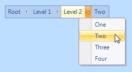

## KryptonBreadCrumb

Use the *KryptonBreadCrumb* control to navigate around a tree hierarchy of
options. The control displays a trail leading from the root to the currently
selected location. This is useful in allowing the user to quickly navigate to a
previous node in the path that leads to the current location. It also has the
advantage of only taking up a small area of the screen, unlike a traditional
tree control. Use the *RootItem* property to define the hierarchy and the
*SelectedItem* property to define the current selection.

 

**Appearance** 

Use the *ControlBackStyle* and *ControlBorderStyle* properties to define the
styling required for control and the *CrumbButtonStyle* to define the appearance
of each individual path entry. You can see in figure 1 the default
appearance using the *Office 2007 - Blue* builtin palette.

*Figure 1 – Default Appearance*

 

 

**Four States**

The visual elements can be in one of four possible states, *Disabled*, *Normal*,
*Tracking* and *Pressed*. The overall control can only be in the *Normal* or
*Disabled* states but the individual crumbs, represented by drop down buttons,
can also be in *Tracking* and *Pressed* states when interacting with the mouse.

 

In order to customize the appearance in each of the four states you can use the
properties *StateDisabled*, *StateNormal*, *StateTracking* and *StatePressed*.
Each of these properties allows you to modify the background, border and content
characteristics of the drop down buttons as well as the border and background of
the overall control.

 

**Common State** 

To speed up the customization process an extra *StateCommon* property has been
provided. The settings from this are used if no override has been defined for
the state specific entry. Note that the specific state values always take
precedence and so if you define the border width in *StateNormal* and
*StateCommon* then the *StateNormal* value will be used whenever the control is
in the *Normal* state. Only if the *StateNormal* value is not overridden will it
look in *StateCommon*.

 

**DropDownNavigation**

By default this is defined as *True* and gives each individual bread crumb item
a drop down button. When pressed the drop down button presents a context menu
with a list of all available child items. On selecting one of the child items in
the menu that child then becomes the newly selected item. Note that if a bread
crumb item does not have any child items defined then it will not show a drop
down button, even if this property is defined as *True*.

 

**RootItem**

This is the root item that starts the hierarchy of possible items. Each items
has a *ShortText*, *LongText* and *Image* set of properties that are used to
define the appearance of the item. Each item also has an *Items* property that
allows child items to be attached. You can modify this hierarchy at design time
to specify a fixed structure or alternatively modify the structure at runtime in
response to application events.

 

**SelectedItem**

Use the *SelectedItem* to define the currently defined path in the control. Note
that the reference **MUST** be one of the items inside the *RootItem* hierarchy.
If you assign *NULL* then the control will be empty of any bread
crumb displayed. If you assign the *RootItem* value then you will see a single
bread crumb entry that represents the root of the available hierarchy. Otherwise
you can assign one of the entries from the *RootItem* structure and it will show
the entire path from the root to the provided reference.

 

**ButtonSpecs**  
You can add buttons to the bread control control by modifying the *ButtonSpecs*
collection exposed by the *KryptonBreadCrumb*. Each *ButtonSpec* entry in the
collection describes a single button for display. You can use the *ButtonSpec*
to control all aspects of the displayed button including visibility, edge,
image, text and more. At design time use the collection editor for the
*ButtonSpecs* property in order to modify the collection and modify individual
*ButtonSpec* instances. See the [ButtonSpec](ButtonSpec.md) section for more
details. Figure 2 shows an example of a *KryptonBreadCrumb* with buttons.

*Figure 2 – KryptonBreadCrumb with ButtonSpecs*

 

**AllowButtonSpecTooltips**  

By default the control will not show any tool tips when you hover the mouse over
the user defined button specifications. If you set this boolean property to
*True* then it will turn on tool tips for those button specs. Use the
*ButtonSpec.TooltipText* property in order to define the string you would like
to appear inside the displayed tool tip.  

**AllowButtonSpecTooltipPriority**

If the parent Item has tooltips, and the button spec has tooltips, then
the default is show both when hovering over the buttonspec. This can be disabled 
by setting `AllowButtonSpecTooltipPriority` to `true`, so that only 1 tooltip is
displayed when hovering over any part of the control.
  
**UseMnemonic**

When this property is defined as *True* for the *KryptonBreadCrumb* it will
check each of the *ButtonSpec* instances in the *ButtonSpecs* collection. If the
*Text* or *ExtraText* in a *ButtonSpec* matches the incoming mnemonic then the
*Click* event for the *ButtonSpec* will be fired.

 
