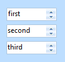
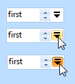

## KryptonDomainUpDown

The *KryptonDomainUpDown* control allows you to display text values with the
ability to use spin buttons to change the value up and down a predefined list.
This control uses the *Krypton* palette to obtain values for the drawing of the
control.

 

**Implementation**  

It is important to note that the implementation of the *Krypton* control is
achieved by embedding a standard windows forms *DomainUpDown* control inside a
custom control. As such the functionality of the edit portion of the control is
the same as that of the standard windows forms control. The *Krypton*
implementation draws the border around the embedded control area and also allows
for the display of *ButtonSpec* instances.

 

You can directly access the embedded control instance by using the
*KryptonDomainUpDown.DomainUpDown* property. This property is not exposed at
design time but can be accessed directly using code. In most scenarios you
should not need to access the underlying control as the majority of methods and
properties for the embedded domain control are exposed directly by the
*KryptonDomainUpDown*. However if you need to implement drag and drop
functionality you will need to hook directly into the events exposed by the
embedded control and not the drag and drop events of the *Krypton* custom
control.

 

**Appearance** 

The *InputControlStyle* property has a default value of *Standalone* giving the
same appearance as seen in figure 1. As the name suggests this is intended for
use in a scenario where the control is used in a standalone fashion and used
on something like a *KryptonPanel* or *KryptonGroup*. The *InputControlStyle* of
*Ribbon* is intended for use when the control is present inside the
*KryptonRibbon* and then needs a different appearance and operation.

*Figure 1 – InputControlStyle = Standalone*

 

**Three States**

Only three possible states of *Disabled, Normal* or *Active* are used by
the domain control. In order to customize the appearance use the corresponding
*StateDisabled, StateNormal* and *StateActive* properties. Each of these
properties allows you to modify the background, border and content
characteristics. Note that the control is restricted to the *Disabled* and
*Active* states if the *AlwaysActive* property is defined as *True*.

 

To speed up the customization process an extra *StateCommon* property has been
provided. The settings from this are used if no override has been defined for
the state specific entry. Note that the specific state values always take
precedence and so if you define the border color in *StateNormal* and
*StateCommon* then the *StateNormal* value will be used whenever the control is
in the *Normal* state. Only if the *StateNormal* value is not overridden will it
look in *StateCommon.*

 

**AlwaysActive**

This property is used to indicate if the control should always be in the active
state. For an *InputControlStyle* of *Standalone* the default value of *True* is
appropriate. However, when you switch to using the *InputControlStyle* of
*Ribbon* you should alter this to *False*.* *A value of *False* means that when
the mouse is not over the control and it also does not have focus it will be
considered inactive. This allows you to specify a different appearance for the
active and inactive states. Figure 2 shows an example of the *Ribbon* style with
the *AlwaysActive* property defined as *False*. The top instance does not have
the mouse over it and the bottom instance does.

*Figure 2 – InputControlStyle = Ribbon*

 

**ButtonSpecs**

Use this collection property to define any number of extra buttons that you
would like to appear at the near or far edges of the control. Figure 3 shows an
example of a button specification that has been created to be positioned at
the *Far* edge with a button style of *ButtonSpec* and a button type of
*Context*. You could then use this button to show a context menu with additional
options relevant to the entry field. Other possible uses of button
specifications might be to indicate error conditions or to initiate the showing
of help information.

*Figure 3 – KryptonDomainUpDown with ButtonSpec definition*

 

**AllowButtonSpecTooltips**  

By default the control will not show any tool tips when you hover the mouse over
the user defined button specifications. If you set this boolean property to
*True* then it will turn on tool tips for those button specs. Use the
*ButtonSpec.TooltipText* property in order to define the string you would like
to appear inside the displayed tool tip.

**AllowButtonSpecTooltipPriority**

If the parent Item has tooltips, and the button spec has tooltips, then
the default is show both when hovering over the buttonspec. This can be disabled 
by setting `AllowButtonSpecTooltipPriority` to `true`, so that only 1 tooltip is
displayed when hovering over any part of the control.