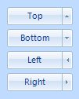
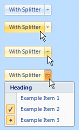

# KryptonDropButton

 

This specialized button control is used to display a context menu when the
button is pressed. An arrow symbol is shown inside the control as a visual
indication of the drop down capability. If you choose to set the *Splitter*
property then the button is split into two sections, a small area that contains
the drop down arrow and the remained that acts like a standard button. Pressing
the button causes the *Click* event to be generated and clicking the drop down
portion of the control fires the *DropDown* event. The content of the control is
contained in the *Values* property. You can define *Text*, *ExtraText* and
*Image* details within the *Values* property.

 

**Appearance**

Use the *Splitter* property to define if the drop down button should be placed
in its own separate area. Figure 1 shows the visual difference between the two
possible settings. You can use the *ButtonOrientation* property to rotate the
control. The default setting of *Top* shows the content in a left to right and
top to bottom arrangement. Specify *Bottom* to have the control displayed upside
down, *Left* to show the content rotated 90 degrees left and *Right* for 90
degrees rotated right. See figure 2 for examples. To alter the position of the
drop down arrow use the *DropDownPosition* property as seen in figure 3. If you
need to change the direction the arrow points, and therefore the location the
context menu appears, then update *DropDownPosition* as shown in figure 4 below.

 

Update *ButtonStyle* to define the top level styling required for the appearance
of the *KryptonDropButton* control. The default value of *Standalone* gives a
solid appearance that should be appropriate for use in most circumstances.
Alternatively you can use the *LowProfile* setting for situations where you need
a transparent border and background. There are also custom styles that can be
defined via a *KryptonPalette* for situations where you need to
create variations on the styles already provided. Custom styles are named simply
*Custom1*, *Custom2* and *Custom3*.

*Figure 1 – Splitter Property*

*Figure 2 – ButtonOrientation Property*

*Figure 3 – DropDownPosition Property*

*Figure 4 – DropDownOrientation Property*  

 

**Four States**

The button can be in one of four possible states, *Disabled*, *Normal*,
*Tracking* and *Pressed*. If the control has been disabled because the *Enabled*
property is defined as *False* then the button will be in the *Disabled* state.

 

When enabled the button will be in the *Normal* state until the user moves the
mouse over the button at which point it enters the *Tracking* state. If the user
presses the left mouse button whilst over the control then it enters the
*Pressed* state. Note that if you have defined the drop down to be a *Splitter*
then the two portions of the button can be in different states. For example,
whilst the mouse is pressed over the drop arrow area that area will be shown in
the *Pressed* state but the remainder will be drawn in the *Tracking* state.

 

In order to customize the appearance of the control in each of the four states
you can use the properties *StateDisabled*, *StateNormal*, *StateTracking* and
*StatePressed*. Each of these properties allows you to modify the background,
border and content characteristics.

 

**Common State** 

To speed up the customization process an extra *StateCommon* property has been
provided. The settings from this are used if no override has been defined for
the state specific entry. Note that the specific state values always take
precedence and so if you define the border width in *StateNormal* and
*StateCommon* then the *StateNormal* value will be used whenever the control is
in the *Normal* state. Only if the *StateNormal* value is not overridden will it
look in *StateCommon*.

 

Imagine the following scenario; you would like to define the border of the
button to be 3 pixels wide with a rounding of 2 pixels and always red. Without
the *StateCommon* property you would need to update the same three border
settings in each of *StateDisabled*, *StateNormal*, *StateTracking* and
*StatePressed* properties. Instead you can define the three border settings in
just *StateCommon* and know they will be used whichever of the four appearance
states the button happens to be using.

 

**State Overrides** 

There are two additional properties called *OverrideDefault* and *OverrideFocus*
that are involved in altering the appearance of the control. Notice that these
start with the *Override* prefix instead of the usual *State*. This is because
they do not relate to a specific control state such as *Normal* or *Tracking*.
Instead they can be applied to any of the four possible states and are used to
override the appearance that would otherwise be shown.

 

**Focus Override** 

If the control currently has the focus then the *OverrideFocus* settings are
applied. This can occur when the control is in *Normal*, *Tracking* or *Pressed*
states. By default the override only alters the appearance so that a focus
rectangle is drawn around the content so that the user can see that the control
currently has the focus.

 

**Default Button Override** 

Each *Form* has the concept of a default button that is clicked when the user
presses the *Enter* key. The *KryptonButton* also supports the default button
mechanism and *OverrideDefault* settings are applied to the appearance whenever
the control has been designated as the default.

 

**Examples of Appearance** 

Figure 5 shows the appearance of different states. The top example shows the
drop button without any mouse interaction. The second and third images show the
mouse tracking over the two areas of the control and the last image shows the
context menu displayed when the drop arrow is pressed.

*Figure 5 – DropDown Appearance*  

