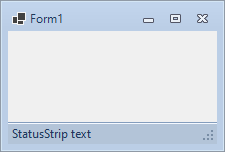
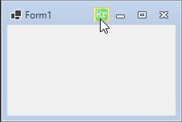
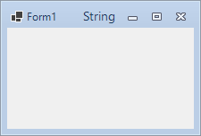

# KryptonForm

The *KryptonForm* derives from *Form* and is intended as the base class for all
your application *Form* instances.  So instead of inheriting your window classes
from *Form* you should always inherit from *KryptonForm*.  The purpose of the
*KryptonForm* is to perform custom chrome painting so that the border and
caption areas of the form are drawn according to the defined palette settings.
This ensures that your whole application has a consistent look and feel that
extends to the windows themselves as well as the regular *Krypton* controls.

**Appearance** 

The *GroupBackStyle* and *GroupBorderStyle* properties are used to define the
border areas of the custom chrome drawing. The default value for both of these
properties is *FormMain.* The *HeaderStyle* property is used to define the
appearance of the caption area of the custom chrome, it has a default value of
*Form*.

**Two States** 

Only two possible states of *Active* and *Inactive* are used by
the *KryptonForm* control. In order to customize the appearance use the
corresponding *StateActive* and *StateInactive* properties. So if you wanted the
custom chrome to have a red border when active but a blue border when inactive
you would alter these two states respectively to achieve that customization.

To speed up the customization process an extra *StateCommon* property has been
provided. The settings from this are used if no override has been defined for
the state specific entry. Note that the specific state values always take
precedence and so if you define the border color in *StateActive* and
*StateCommon* then the *StateActive* value will be used whenever the control is
in the *Active* state. Only if the *StateActive* value is not overridden will it
look in *StateCommon*.

**AllowFormChrome**

The default value for this property is *True* and indicates that the form is
allowed to have custom chrome painting if all other criteria are matched. Other
criteria include the *KryptonManager.GlobalAllowFormChrome* being set to True as
well as the palette being used for drawing having an *AllowFormChrome* setting
of *True*. So you will only have custom chrome is the form, palette and global
manager allowed it to be used.

If you set this property to *False* then the form will not perform custom
painting of borders and caption area no matter what the global manager and
palette might request. When custom chrome is not applied then the window shows a
standard appearance appropriate for the operating system.

**AllowStatusStripMerge**

In order to achieve a professional looking appearance it is possible to request
that the status strip of the form be merged into the border area. This gives an
integrated look can be observed with many of the *Office 2007* applications. To
prevent status strip merging just set this property to *False*. When defined as
*True*, the default, there are several criteria that must be met before status
strip merging will occur.

First of all the form can only merge an instance of the *StatusStrip* control
into the border, the older *StatusBar* cannot be merged nor any custom control
that you have created. Second the *StatusStrip* must be visible and have
a *Dock* value of *DockStyle.Bottom*, thus showing the control is intended to be
at the bottom of the form and sized to fill the entire width of the client area.
Last of all the StatusStrip must be using a *RenderMode* setting of
*ToolStripRenderMode.ManagerRenderMode*. Only if all these criteria are met will
the control be considered for merging. Figure 1 shows an example of a status
strip merged and not merged so you can see the visual difference.

 

*Figure 1 - StatusStripMerging = True & False*

 

**AllowButtonSpecTooltips**  
By default the control will not show any tool tips when you hover the mouse over
the user defined button specifications. If you set this boolean property to
*True* then it will turn on tool tips for those button specs. Use the
*ButtonSpec.TooltipText* property in order to define the string you would like
to appear inside the displayed tool tip.  
  
**ButtonSpecs**  
You can add buttons to the caption area by modifying the *ButtonSpecs*
collection exposed by the *KryptonForm*. Each *ButtonSpec* entry in the
collection describes a single button for display on the header. You can use the
*ButtonSpec* to control all aspects of the displayed button including
visibility, edge, image, text and more. At design time use the collection editor
for the *ButtonSpecs* property in order to modify the collection and modify
individual *ButtonSpec* instances. See the [ButtonSpec](buttonspec.md) section for
more details. Figure 2 shows an example of a *KryptonForm* with an extra button.

*Figure 2 – KryptonForm with extra ButtonSpec*

 

 

**Caption Values**  
You can specify three values that are then displayed inside the caption
area. Two of these are existing properties of the form, *Text* and *Icon*. The
third property is a new one called *ExtraText* and allows an additional string
to be specified and displayed. Figure 3 shows the result of defining a value for
this *ExtraText* property.  

  
  
*Figure 3 – ExtraText = "String"*

**Blur Values**
You can specify four values to blur the form when inactive. To enable this functionality,
you will need to set both *BlurWhenFocusLost* & *EnableBlur* properties to *true* under
*BlurValues*. The *Opacity* property allows you to set how much 'blur' is applied to the
source form, and the *Radius* property allows you to set the gausian pixel radius used
to blur each pixel.

*Figure 4 – Example of blur in action*