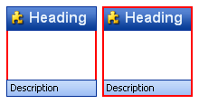
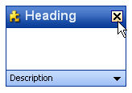
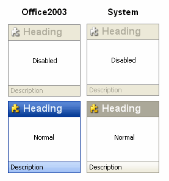

# KryptonHeaderGroup

Use the *KryptonHeaderGroup* control to combine the benefits of the
*KryptonHeader* and the *KryptonGroup* into one. When you need to group together
related controls and provide a heading for them then the *KryptonHeaderGroup*
should be used. You can position and define two headers within the header group
control.

 

The content of the control is contained in the *ValuesPrimary* and
*ValuesSecondary* properties. You can define *Heading*, *Description* and
*Image* details within each of the *ValuesPrimary* and *ValuesSecondary*
properties.

 

**Appearance** 

The *GroupBackStyle* and *GroupBorderStyle* properties are used to determine the
styling of the background and border of the main control. The group border is
the border that encloses the entire control and does not control the border
drawing of the individual headers. The group background is the client area that
is used to contain child controls and does not control the background drawing of
the individual headers.

 

To control the styling of the first header use the *HeaderStylePrimary* property
and *HeaderStyleSecondary* for the second header. These have default values
of *Primary* and *Secondary* respectively.

 

By default the primary header is positioned at the top of the control and the
secondary header at the bottom. You can change this by altering the
*HeaderPositionPrimary* and *HeaderPositionSecondary* values as can be seen in
the examples in figure 1.

*Figure 1 – HeaderPositionPrimary and HeaderPositionSecondary*

 

If you do not require both headers to be displayed then just modify the
*HeaderVisiblePrimary* and *HeaderVisibleSecondary* properties as appropriate.
By combining the style, position and visibility properties you should be able to
customize the layout and appearance to whatever you need.  
  
**Collapsing and Expanding Groups**  

By default the *KryptonHeaderGroup* has a *Collapsed* property value of *False,*
indicating that the client area of the group should be shown. If you set
*Collapsed* to *True* then the client area will be hidden from view. It will
also use the *CollapsedTarget* property to decide on which headers should be
visible in the collapse state. The default value is *CollapseToPrimaryHeader*
and so will cause the primary header to be shown and the secondary header to be
hidden. You can use the alternative values of *CollapseToSecondaryHeader* or
*CollapseToBothHeaders* if you need an alternative collapsed appearance.  
  
Note that the size of the header group will not change when you toggle the
*Collapsed* property unless you set the *AutoSize* property to be *True*. The
most common way of implementing an auto sizing header group is to dock it
against one of the form edges. You will also want to modify the *MinimumSize*
and *MaximumSize* values for the panel contained inside the header group
(accessed from the *Panel* property of the *KryptonHeaderGroup* control). This
is to ensure that when *AutoSize* is used it will calculate the required size
appropriately.  
  
The last property involved in collapsing functionality is called
*AuotCollapseArrow* and defaults to *True*. If your *KryptonHeaderGroup* control
has a *ButtonSpec* defined that has a *Type* of *ArrowUp*, *ArrowDown*,
*ArrowLeft* or *ArrowRight* the it will automatically toggle the collapsed state
when that *ButtonSpec* is clicked. It also inverts the *Type* and so *ArrowUp*
would be automatically changed into *ArrowDown*. This property means you can
implement a fully working collapsing/expanding header group without needing to
write a single line of code. Check out the [Expanding HeaderGroups (DockStyle)](../Tutorials/Expanding%20HeaderGroups%20DockStyle.md) tutorial to see the detailed steps.

 

**Two States** 

Only two possible states of *Disabled* and *Normal* are used by the header
control. In order to customize the appearance use the corresponding
*StateDisabled* and *StateNormal* properties. Each of these properties allows
you to modify the background and border of the control as well as the
background, border and content of the headers.

An additional property called *OverlayHeaders* is available in each of the state
properties and determines if the headers are draw over the top of the group.
Figure 2 shows an example of both settings where the border of the control is
red and two pixels thick. In the first image you can see that *OverlayHeaders*
is *True* and so the headers are drawn over the red border. In the second image
the property is *False* and now the red border is drawn on top of the headers.

*Figure 2 – OverlayHeaders True and False*

 

To speed up the customization process an extra *StateCommon* property has been
provided. The settings from this are used if no override has been defined for
the state specific entry. Note that the specific state values always take
precedence and so if you define the text font in *StateNormal* and *StateCommon*
then the *StateNormal* value will be used whenever the control is in the
*Normal* state. Only if the *StateNormal* value is not overridden will it look
in *StateCommon*.

 

**ButtonSpecs**  

You can add buttons to the individual headers by modifying the *ButtonSpecs*
collection exposed by the *KryptonHeaderGroup*. Each *ButtonSpec* entry in the
collection describes a single button for display on one of the headers. You can
use the *ButtonSpec* to control all aspects of the displayed button including
visibility, edge, image, text and more. At design time use the collection editor
for the *ButtonSpecs* property in order to modify the collection and modify
individual *ButtonSpec* instances. See the [ButtonSpec](buttonspec.md) section for
more details. Figure 3 shows an example of a *KryptonHeaderGroup* with buttons.

*Figure 3 – KryptonHeaderGroup with ButtonSpecs*

  
**AllowButtonSpecTooltips**  

By default the control will not show any tool tips when you hover the mouse over
the user defined button specifications. If you set this boolean property to
*True* then it will turn on tool tips for those button specs. Use the
*ButtonSpec.TooltipText* property in order to define the string you would like
to appear inside the displayed tool tip.

**AllowButtonSpecTooltipPriority**

If the parent Item has tooltips, and the button spec has tooltips, then
the default is show both when hovering over the buttonspec. This can be disabled 
by setting `AllowButtonSpecTooltipPriority` to `true`, so that only 1 tooltip is
displayed when hovering over any part of the control. 

**UseMnemonic**

When this property is defined as *True* for the *KryptonHeaderGroup* it will
check each of the *ButtonSpec* instances in the *ButtonSpecs* collection. If the
*Text* or *ExtraText* in a *ButtonSpec* matches the incoming mnemonic then the
*Click* event for the *ButtonSpec* will be fired.

 

**Examples of Appearance** 

Figure 4 shows the header group in the *Disabled* and *Normal* states for the
*Professional - Office 2003* and *Professional - System* palette modes.

*Figure 4 – Examples of appearance*
