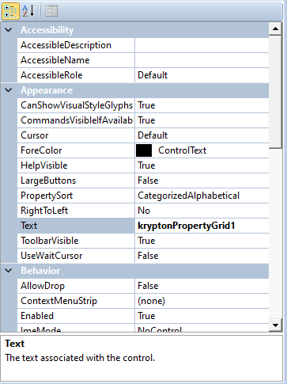

# KryptonPropertyGrid

Use the _KryptonPropertyGrid_ when you need to manipulate the properties of other objects. To set the _KryptonPropertyGrid_ up for use, please alter the `SelectedObject` to the object that you want to use it with.

### Appearance

The _KryptonPropertyGrid_ is designed to fit into the existing toolkit. The control is fully theme-able, as it uses the same states as other controls in the toolkit.

*Figure 1 - A KryptonPropertyGrid control*
