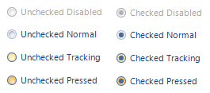

# KryptonRadioButton

 

Multiple *KryptonRadioButton* instances are used together to provide a group of
possible options that the user can choose from. This control combines the
radio button functionality with the styling features of the *Krypton Toolkit*.
The user can check the radio button by using the mouse or a keyboard mnemonic.
Place code in the *CheckedChanged* event handler to perform actions based on the
checked state. The content of the control is contained in the *Values* property.
You can define *Text*, *ExtraText* and *Image* details within the *Values*
property.

 

**Appearance** 

The control uses a label style for presenting the text and image associated with
the radio button. The *LabelStyle* property has a default value of
*NormalControl* giving the same appearance as a *KryptonLabel* instance. If you
place the radio button control onto a *Panel* background then you are
recommended to change the *LabelStyle* to *NormalPanel* so that the label has an
appropriate contrasting appearance.  
 

You can use the *Orientation* property to rotate the control. The default
setting of *Top* shows the content in a left to right and top to bottom
arrangement. Specify *Bottom* to have the control displayed upside down, *Left*
to show the content rotated 90 degrees left and *Right* for 90 degrees rotated
right. See figure 1 for examples.

*Figure 1 – Orientation Property*

 

To alter the relative location of the radio button use the *CheckPosition*
property. The default is Left and shows the radio button on the left side of the
control values. Alternatively use the *Top*, *Bottom* or *Right* values as shown
in Figure 2.

*Figure 2 – Orientation Property*

 

 

**Checked**

The Checked property is a boolean property that returns *True* when the radio
button is checked and otherwise returns *False*. You can hook into the
*CheckedChanged* event in order to be notified when the property has changed
values.

 

**AutoCheck**

If the radio button becomes checked you would normally want all other radio
buttons inside the same container to become unchecked. With this property
defined as *True*, which is the default, this will happen automatically. If
instead you would prefer to manually update the checked state of your radio
buttons then set this to *False* for all instances inside the same container.

 

**Two States**

Only two possible states of *Disabled* and *Normal* are used by
the radio button control. In order to customize the appearance use the
corresponding *StateDisabled* and *StateNormal* properties. Note that only the
content characteristics can be modified as the radio button never has a border
or background.

 

To speed up the customization process an extra *StateCommon* property has been
provided. The settings from this are used if no override has been defined for
the state specific entry. Note that the specific state values always take
precedence and so if you define the text font in *StateNormal* and *StateCommon*
then the *StateNormal* value will be used whenever the control is in the
*Normal* state. Only if the *StateNormal* value is not overridden will it look
in *StateCommon*.

 

**Focus Override**

If the control currently has the focus then the *OverrideFocus* settings are
applied. This can occur when the control is in the *Normal* state. By default
the override only alters the appearance so that a focus rectangle is drawn
around the content so that the user can see that the control currently has the
focus.

 

**Examples of Appearance**

Figure 3 shows the appearance when using the *Office 2007 - Blue* palette with
the default settings. You can see checked and unchecked appearance when
disabled, normal, tracking or pressed down.

*Figure 3 – RadioButton Appearance*
