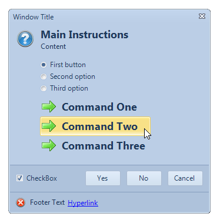
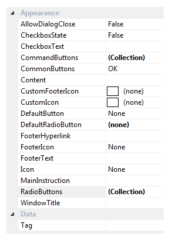

# KryptonTaskDialog

The *KryptonTaskDialog* provides an extended version of the standard
*MessageBox* but with more flexibility. The windows *TaskDialog* was introduced
with *Windows Vista* and the Krypton version is intended to provide most, but
not all, of the same functionality. Try using the KryptonTaskDialogExamples
sample that comes with the *Toolkit* in order to see and experiment with the
*KryptonTaskDialog* implementation. Figure 1 shows an example of the
KryptonTaskDialog with all the possible options used.



*Figure 1 – KryptonTaskDialog Example*

 

 

 

**Usage**

You can invoke the *KryptonTaskDialog* in one of two ways. The quickest and
easiest is to use one of the overrides for the static *Show* method. This can be
called without the need to create an instance of any component and will return a
*DialogResult* as the result of the operation. This method of operation mimics
the static *Show* methods that exist for the *KryptonMessageBox* and standard
.NET *MessageBox* components. Here is an example code showing how this can be
achieved:-

 
```cs
    DialogResult result = KryptonTaskDialog.Show("Window Title",  
                                                 "Main Instructions",  
                                                 "Content",  
                                                 MessageBoxIcon.Information,  
                                                 TaskDialogButtons.OK \|  
                                                 TaskDialogButtons.Cancel);

    switch (result)  
    {  
        case DialogResult.OK:  
            break;

        case DialogResult.Cancel:  
            break;  
    }
```

A limitation with the above approach is that not all the functionality of the
task dialog can be accessed in this manner. To enable use of all the possible
features you should use the second approach. This involves creating an instance
of the *KryptonTaskDialog* and then setting properties on the instance before
calling the *ShowDialog* method of the component. On return from the
*ShowDialog* call you can then examine the properties of the component that have
been updated by the user operating the dialog. For example, the
*KryptonTaskDialog.CheckboxState* will be updated with the checked state of the
check box control that was shown to the user in the dialog. Here is an example
of using the second approach:-

 
```cs
    using(KryptonTaskDialog kryptonTaskDialog = new KryptonTaskDialog())  
    {  
        kryptonTaskDialog.WindowTitle = "Window Title";  
        kryptonTaskDialog.MainInstruction = "Main Instruction";  
        kryptonTaskDialog.Content = "Content";  
        kryptonTaskDialog.Icon = MessageBoxIcon.Warning;  
        kryptonTaskDialog.CommonButtons = TaskDialogButtons.OK |
        TaskDialogButtons.Cancel;  
        kryptonTaskDialog.DefaultButton = TaskDialogButtons.OK;  
        kryptonTaskDialog.FooterText = "Footer Text";  
        kryptonTaskDialog.FooterHyperlink = "Hyperlink";  
        kryptonTaskDialog.FooterIcon = MessageBoxIcon.Error;  
        kryptonTaskDialog.CheckboxText = "Checkbox Text";  
        kryptonTaskDialog.CheckboxState = false;  
        kryptonTaskDialog.AllowDialogClose = true;  
  
        DialogResult result = kryptonTaskDialog.ShowDialog();

        switch (result)  
        {  
            case DialogResult.OK:  
                break;

            case DialogResult.Cancel:  
                break;  
        }         
    }
```

To simplify the setting of the properties it would be easier to drag the
*KryptonTaskDialog* from the toolbox onto the *Form* and then use the properties
window to modify the component properties as needed at design time. Then you
need only invoke the *ShowDialog* method and process the result rather than
manually writing the code to set the properties. This also makes it easier to
hook into the events generated by the component.

 

  
**String Localization**

The dialog buttons text will always display in English by default. If you need
to localize the strings to other languages you can do so by placing a
*KryptonManager* component on your main *Form*. Use the properties window and
then expand the *GlobalStrings* property and modify the strings as needed.

 

  
**KryptonTaskDialog Properties**

Figure 2 shows a list of all the properties that can be used to define the
appearance of the component.

 

 

*Figure 2 – KryptonTaskDialog Properties*

 

 

*AllowDialogClose*

The dialog will only have a window close button if either this property is
defined as *True* or the *Cancel* button is one of the *CommonButtons*,
otherwise the dialog will not have a close button. When the dialog is allowed to
be closed the user can use the *ESCAPE* key, the *ALT+F4* key combination or the
window close button.

 

*CheckboxState*  
*CheckboxText*

If the *CheckboxText* is defined with a string then a check box control will
appear on the dialog buttons area of the window with an initial state of
*CheckboxState*. When the window has been dismissed the *CheckboxState* will be
updated with whatever value the user defined whilst it was showing.

 

*CommonButtons*  
*DefaultButton*

The set of dialog buttons displayed is determined by the *CommonButtons*
setting. *DefaultButton* specifies which of the showing dialog buttons should be
the default and so initially focused when the dialog is displayed.

 

*RadioButtons*  
*DefaultRadioButton*

CommandButtons

Just below the main text of the dialog a set of radio buttons are displayed in
response to the entries in the *RadioButtons* collection. The initial radio
button to be checked is defined by the *DefaultRadioButton* property. This
property is updated as the user selects different radio buttons at runtime and
so once the dialog is dismissed you can examine the DefaultRadioButton property
to find out what entry the user selected. The *CommandButtons* collection
specifies a series of display buttons below the radio buttons. If the user
selects one of these buttons then the *DialogResult* defined for that
*CommonButtons* entry is returned as the result of showing the dialog.

 

*FooterText*  
*FooterHyperlink*  
*FooterIcon*  
*CustomFooterIcon*

The footer area will be shown if any of the footer related properties has been
defined. The *CustomFooterIcon* is used as the source of the footer icon if
defined, otherwise the *FooterIcon* property is used instead. To the right of
the icon any *FooterText* string is shown and finally the *FooterHyperlink*
string is shown as a link label that can be clicked. If the user clicks the link
label then the *KryptonTaskDialog.FooterHyperlinkClicked* event is fired so you
can perform an appropriate action.

 

*WindowTitle*  
*MainInstruction*  
*Content*

*Icon*

*CustomIcon*

These properties represent the basic settings of the dialog. The *WindowTitle*
is used as the caption shown in the dialog caption bar. *MainInstruction* and
*Content* are strings displayed in the main section of the dialog client area.
The *CustomIcon* is used as the source of the main icon if defined, otherwise
the *Icon* property is used instead. See Figure 1 for an example of how the
various properties are displayed at runtime.

 

*Tag*  
Custom data field for use by the application developer.

 

**KryptonTaskDialog Events**

There is just a single event of interest. The
*KryptonTaskDialog.FooterHyperlinkClicked* event is fired when the user clicks
the footer hyper link label. This occurs whilst the dialog is still being shown.
