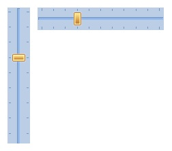
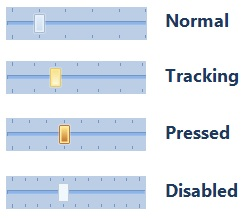

# KryptonTrackBar

 

The *KryptonTrackBar* is a scrollable control similar to the scroll bar. You can
configure ranges through which the value of the *Value* property of a track bar
scrolls by setting the *Minimum* property to specify the lower end and the
*Maximum* property to specify the upper end of the range. The *LargeChange*
property defines the increment to add or subtract from the *Value* property when
clicks occur either side of the track position indicator. The *SmallChange*
property defines the increment to add or subtract from the *Value* property when
using the keyboard. You can use the *Orientation* property to change the default
horizontal appearance to become vertical.

 

**Appearance** 

The *Orientation* property is used to change the direction of the track bar
control. Figure 1 shows the vertical and horizontal values. You will see also in
Figure 1 that ticks marks are displayed on both sides of the track. You can use
the *TickStyle* to modify this and present tick marks on only one of the sides
or not at all. Use the *TickFrequency* property to define how often a tick mark
is drawn. By default the tick marks are drawn for each value between the
*Minimum* and *Maximum* property values but you can alter the *TickFrequency* to
show them less often. Finally the *TrackBarSize* is an enumeration property with
possible values of *Small*, *Medium* and *Large* and specifies how large the
track and track indicator are drawn. Figure 1 shows instances with the default
value of *Medium*.

 

*Figure 1 - Orientation settings.*  

 

**Four States**

The track bar can be in one of four possible states, *Disabled*, *Normal*,
*Tracking* and *Pressed*. If the control has been disabled because the *Enabled*
property is defined as *False* then the track bar will be in the *Disabled*
state. When enabled the track bar will be in the *Normal* state until the user
moves the mouse over the track bar position indicator at which point it enters
the *Tracking* state. If the user presses the left mouse button whilst over the
position indicator then it enters the *Pressed* state.

 

In order to customize the appearance of the control in each of the four states
you can use the properties *StateDisabled*, *StateNormal*, *StateTracking* and
*StatePressed*.

 

**Common State** 

To speed up the customization process an extra *StateCommon* property has been
provided. The settings from this are used if no override has been defined for
the state specific entry. Note that the specific state values always take
precedence and so if you define the border width in *StateNormal* and
*StateCommon* then the *StateNormal* value will be used whenever the control is
in the *Normal* state. Only if the *StateNormal* value is not overridden will it
look in *StateCommon*.

**Focus Override** 

If the control currently has the focus then the *OverrideFocus* settings are
applied. This can occur when the control is in *Normal*, *Tracking* or *Pressed*
states. By default the override only alters the appearance so that the track bar
position indicator shows that the control has the focus.

 

**Examples of Appearance** 

Figure 2 shows the appearance when a track bar is using the *Office 2010 Blue*
palette and for each of the different possible states.

*Figure 2 - TrackBar states.*
