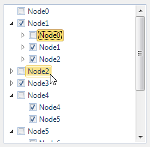
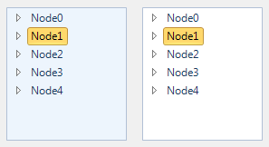
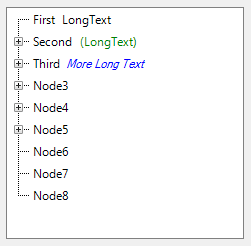

# KryptonTreeView  
   
Use the *KryptonTreeView* when you need to present a hierarchical collection of
labeled items. If the number of items exceeds the number that can be displayed
then a scroll bar is automatically shown. Use the *Nodes* property to define the
top level root nodes of the hierarchy. Hook into the *AfterSelect* event to be
notified when the selected node is changed.  
   
**Appearance**  
Use the *BackStyle*, *BorderStyle* and *ItemStyle* properties to alter the
appearance of the control and the node items. The first two of these properties
define the appearance of the overall control but the *ItemStyle* is used to
define the display of the individual node items themselves. You can see in
figure 1 the default appearance using the *Office 2010 - Blue* builtin palette.  
   

*Figure 1 – Default Appearance*  

   
**Eight States**  
There are eight different states relating to the control but not all the states
are relevant to every part of the control.

The border and background of the control use just the *StateNormal*,
*StateDisabled* or *StateActive* sets of properties. If the control has been
disabled because the *Enabled* property is defined as *False* then the control
always uses the *StateDisabled* values. When the control is active the
*StateActive* properties are used and when not active the *StateNormal*. Being
currently active means it has the focus or the mouse is currently over the
control. Note that if the *AlwaysActive* property is defined as *True *then it
ignores the *StateNormal* and always uses the *StateActive* regardless of the
current active state of the control.  
   
Drawing of the individual node items uses all the state properties except
*StateActive*. This is because the node items are not drawn differently
depending on the active state of the control. All the states that begin with the
*StateChecked* name are used for items that are currently selected. When not
selected an item uses one of the *StateNormal*, *StateTracking* or
*StatePressed* properties.   
   
**Common State**  
To speed up the customization process an extra *StateCommon* property has been
provided. The settings from this are used if no override has been defined for
the state specific entry. Note that the specific state values always take
precedence and so if you define the border width in *StateNormal* and
*StateCommon* then the *StateNormal* value will be used whenever the control is
in the *Normal* state. Only if the *StateNormal* value is not overridden will it
look in *StateCommon*.  
   
Imagine the following scenario; you would like to define the border of the
button to be 3 pixels wide with a rounding of 2 pixels and always red. Without
the StateCommon property you would need to update the same three border settings
in each of *StateDisabled*, *StateNormal*, *StateTracking* etc properties.
Instead you can define the three border settings in just *StateCommon* and know
they will be used whichever of the states the tree view happens to be using.  
   
**Focus Override**  
If the control currently has the focus then the *OverrideFocus* settings are
applied to the item that has the focus indication. This can occur when the
control is in *Normal*, *Tracking* or *Pressed* states. By default the override
only alters the appearance so that a focus rectangle is drawn around the node
item contents so that the user can see that the control currently has the focus.  
  
**AlwaysActive**  
This property is used to indicate if the control should always be in the active
state. For an *InputControlStyle* of *Standalone* the default value of *True* is
appropriate. However, when you switch to using the *InputControlStyle* of
*Ribbon* you should alter this to *False*.* *A value of *False* means that when
the mouse is not over the control and it also does not have focus it will be
considered inactive. This allows you to specify a different appearance for the
active and inactive states. Figure 2 shows an example of the *Ribbon* style with
the *AlwaysActive* property defined as *False*. The left instance does not have
the mouse over it and the right instance does.

 

*Figure 2 – InputControlStyle - Ribbon*

 

  
**KryptonTreeNode**  
You can add standard *TreeNode* instances to the node hierarchy and it will use
the *Text* property to recover the text for display. Alternatively you can add
*KryptonTreeNode* instances that derive from that standard *TreeNode* class and
add an additional *LongText* property for display to the right of the standard
node text. Figure 3 shows an example with several instances of this class added
to the root *Nodes* collection.

 

 

*Figure 3 – Nodes collection containing KryptonTreeNode instances*
