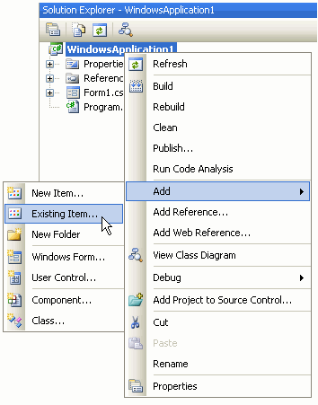
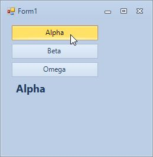

# Standard Toolkit Tutorials

Use these simple step by step guides to learn more about using the *Krypton*
suite. 
  
  
## Krypton Toolkit Tutorials

| [Using Krypton in Visual Studio 2022](Tutorials/Using%20Krypton%20in%20Visual%20Studio%202022.md)        | [Using Images With Buttons](Tutorials/Using%20Images%20With%20Buttons.md)                                                                                          |
|----------------------------------------------------------------------------------------------------------|--------------------------------------------------------------------------------------------------------------------------------------------------------------------|
| Follow these simple steps to add the *Krypton* set of components to the Toolbox in *Visual Studio 2022*. | See how to quickly achieve the look and feel you want using one of these simple techniques. These apply to *KryptonButton*, *KryptonCheckButton* and *ButtonSpec*. |

| [Embedding Palette Definitions](Tutorials/Embedding%20Palette%20Definitions.md)                                                                                                            | [Multiple Choice Buttons](Tutorials/Multiple%20Choice%20Buttons.md)        |
|
| Embed palette definition XML files into your assembly resources and then load them at runtime. This deployment method reduces the risk of the user deleting your palette definition files. | Learn how to add a group of mutually exclusive buttons to your application. Combine the *KryptonCheckSet* with *KryptonCheckButton* instances in just a few seconds!                     | 
|                                                                                                                                                                   |                                                                                                                                                            | 
| [Three Pane Application](Tutorials/Three%20Pane%20Application.md)                                                                                                                          | [Expanding HeaderGroups (Splitters)](Tutorials/Expanding%20HeaderGroups%20Splitters.md)                                                                                                  | 
| Starting from a new project you learn how to build a simple three pane application using the *Krypton Toolkit* controls. Use this as a starting point for building up your application.    | Allow the user to expand and collapse header groups at runtime. This variation uses split containers so the user can change the relative spacing of the groups.                          | 
|                                                                                                                           |                                                                                                                | 
| [Expanding HeaderGroups (DockStyle)](Tutorials/Expanding%20HeaderGroups%20DockStyle.md)                                                                                                    | [Expanding HeaderGroups (Stack)](Tutorials/Expanding%20HeaderGroups%20Stack.md)                                                                                                          |
| Allow the user to expand and collapse header groups at runtime. In this variation the groups are docked against the form edges and not a single line of code is needed.                    | Allow the user to expand and collapse header groups at runtime. The header groups use up space from the center group as they expand. Create this scenario without a single line of code. | 
|                                                                                                           |                                                                                                                |

## Krypton Navigator Tutorials

| [User Page Creation](Tutorials/User%20Page%20Creation.md)                                                                                                                                        |
|                                                                                                                                                                            |
| Add Internet Explorer 7 style operation by having a minimum of two pages and clicking the last page creates another page automatically.                                    |
|  |

