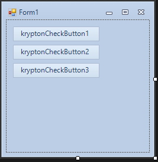
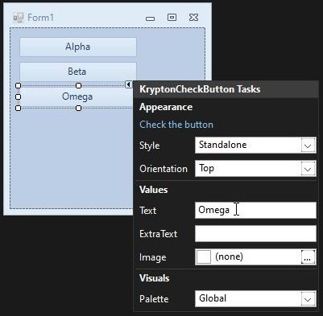
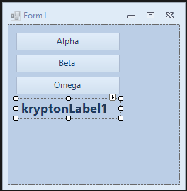
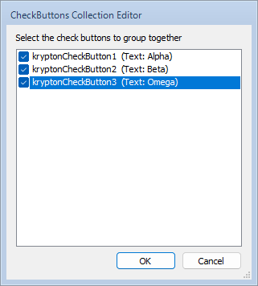
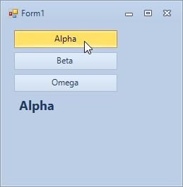
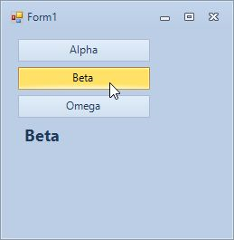

Tutorial – Multiple Choice Buttons

 

**1) Create a new Windows Forms project**  


This will automatically create a form in design mode as below.


**2) Ensure that the Krypton Toolkit components are in the Toolbox**  
If not the [Using Krypton in Visual Studio 2022](Using%20Krypton%20in%20Visual%20Studio%202022.md)
tutorial can be used to add them.

 

 

**3) Drag and drop three KryptonCheckButton instances onto the form**  


Place the controls in a vertical line as shown below.



**4) Use the KryptonCheckButton smart tags to enter ‘Text’ values of ‘Alpha’,
‘Beta’ and ‘Omega’**

You can use the properties window to change the ‘Text’ values but the smart tag
provides easier access to the common values and operations on all Krypton
controls. As you can see below you just need to click the small arrow on the top
right of each control in order to display the smart tag for the control.



**5) Drag and drop a KryptonLabel instance below the check buttons**  


We will use the label control for feedback on the current choice selected.



**6) Drag and drop a KryptonCheckSet instance onto the form**  


The KryptonCheckSet set is used to manage the exclusive selection logic and is a
component placed onto the component tray area. When you drop the component onto
the form it will not create a control but instead a component as shown below in
the area at the bottom of the design screen.


**7) Find the ‘CheckButtons’ property in the properties window and press the ‘…’
button**  
The '...' button as shown below indicates that the collection will be edited by
showing a modal dialog.


**8) Select all three check button entries and press ‘OK’**  


The collection editor for the KryptonCheckSet component allows the user to
specify which of the KryptonCheckButton instances it should manage. As you can
see below, all three of the controls we added earlier are displayed along with
the current text they are showing. You should click the check box for each entry
so they are all ticked.



**9) Double click the ‘kryptonCheckSet1’ component** 

This will generate a default event handler for the CheckedButtonChanged event
that we are using to update the label control with details of the new selection.
Enter the following code into the handler.

```cs
private void kryptonCheckSet1_CheckedButtonChanged(object sender, EventArgs e)
{

   KryptonCheckButton cb = (KryptonCheckButton)kryptonCheckSet1.CheckedButton;

   kryptonLabel1.Text = cb.Text;

}
```


Then add the following statement to the top of the source file so that it will
compile.

```cs
using Krypton.Toolkit;
```

**10) Compile and run the application**  


As you click the different check buttons the check set is automatically ensuring
that only one button at a time is checked and then generating the checked
changed event so that we can update the label with the new selection. You can
see below the results of clicking the first and second check buttons.

 