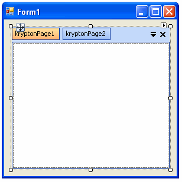
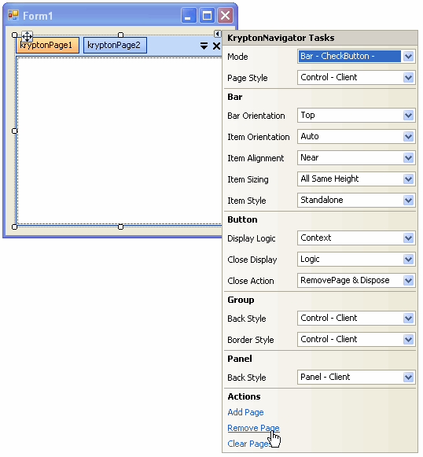
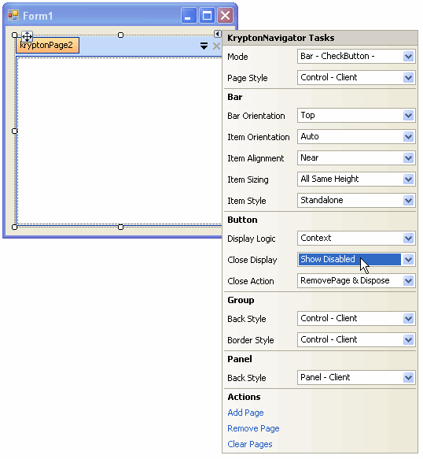
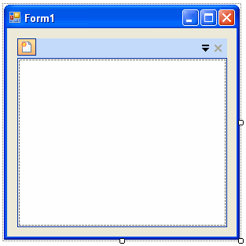
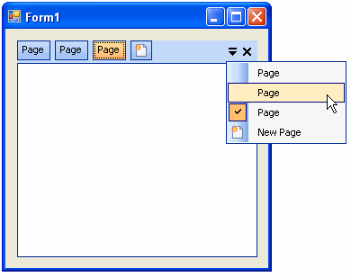

# User Page Creation

## Tutorial – User Page Creation

 

**1) Create a new Windows Forms project**


This will automatically create a form in design mode as below.


**2) Ensure that the Krypton components are in the Toolbox**

If not the [Using Krypton in Visual Studio 2022](Using%20Krypton%20in%20Visual%20Studio%202022.md) tutorial can be used to add them.


**3) Drag a KryptonNavigator from the toolbox onto the client area**

Once dropped resize the control so it takes up most of the client space as shown below.



**4) Click the smart tag and then select the 'Remove Page' action**



We only want the navigator to have a single page at design time, so we remove one of the default pages. 

**5) Change the 'Close Display' property on the smart tag to be 'Show Disabled'**

We want to prevent the user from deleting the single page that is now shown. 



**6) Click the edit button for the 'Pages' property of the navigator in the properties window**

Once clicked you should have the following page collection editor displayed.


**7) Set the 'Text' and 'Text Title' properties of the page to be an empty.**

The page header should not display any text and so select and delete the string values for the 'Text' and 'Text Title' properties.

**8) Select an appropriate new page image for the 'ImageSmall' property.**

Click the 'ImageSmall' property and use the edit button to import an image for display. The example that can be run from the Krypton Explorer uses an image of a document with a star in the corner, to indicate that clicking the page will create a new document. You can use whatever image is appropriate for your application.

**9) Press the OK button to accept the change.**

You should now have the following display for the navigator at design time.



**10) Double click the title bar of the form so the 'Load' event handler is generated.**

We need to ensure that there is always one document page in addition to the last 'New Page' page that is present at design time. So we need to add code so that as soon as the form is loaded the initial document page is created and added to the navigator. You need to add just one line of code to the event handler so it looks like this.

```cs
private void Form1_Load(object sender, EventArgs e)
{
    // Add the initial document page
    InsertNewPage();
}
```

**11) Add the 'InsertNewPage' method implementation.**

Add the following simple code to create a new page add add it just before the 'New Page' entry.

```cs
using Krypton.Toolkit;
using Krypton.Navigator;

private void InsertNewPage()
{
    // Create a new page and give it a simple name
    KryptonPage newPage = new KryptonPage();
    newPage.Text = "Page";

    // Insert page before the last page
    kryptonNavigator1.Pages.Insert(kryptonNavigator1.Pages.Count - 1, newPage);

    // Make the new page the selected page
    kryptonNavigator1.SelectedPage = newPage;

    // If this is the third page then we must have two document pages
    // and so the user is now allowed to delete document pages
    if (kryptonNavigator1.Pages.Count == 3)
        kryptonNavigator1.Button.CloseButtonDisplay = ButtonDisplay.ShowEnabled;
}
```

Once the new page has been created it is added as the second to last page. We do not insert it at the end because the 'New Page' entry is always left as the last entry. Once the page is added it is selected for use. Last of all a check is made to decide if the user is allowed to delete document pages.


**12) Add a handler for the KryptonNavigator event called 'SelectedPageChanged'**

Select the navigator control on the form and then use the properties window to list the available events. Find the 'SelectedPageChanged' entry and then double click the value for the property, this will cause an empty event handler to be created in the code window. Now add the following code to the handler.

```cs
private void kryptonNavigator1_SelectedPageChanged(object sender, EventArgs e)
{
    // Selecting the 'New Page' entry should create a new page
    if (kryptonNavigator1.SelectedIndex == (kryptonNavigator1.Pages.Count - 1))
        InsertNewPage();
}
```

This event is fired whenever the user selects a new page, so if they select the last page we want to perform the special action of creating a new document page for the user.


**13) Add a handler for the KryptonNavigator event called 'CloseAction'**

Select the navigator control on the form and then use the properties window to list the available events. Find the 'CloseAction' entry and then double click the value for the property, this will cause an empty event handler to be created in the code window. Now add the following code to the handler.

```cs
private void kryptonNavigator1_CloseAction(object sender, CloseActionEventArgs e)
{
    // Prevent the last page from being selected when second to last page is removed
    if (e.PageIndex == (kryptonNavigator1.Pages.Count - 2))
        kryptonNavigator1.SelectedIndex = kryptonNavigator1.Pages.Count - 3;

    // Prevent the last document window from being removed
    if (kryptonNavigator1.Pages.Count == 3)
        kryptonNavigator1.Button.CloseButtonDisplay = ButtonDisplay.ShowDisabled;
}
```

The purpose of the first 'if' statement is to check to see if the second to last page is being removed. If so we need to change the current selection to a previous page in order to prevent some unexpected behavior. Without this change the selection would automatically be shifted to the last page, but the last page is the 'new page' entry. When the 'new page' entry is selected it automatically creates a new page. So if we did not alter the selection manually then removing the second to last page would cause a new page to be created it its place.

The second 'if' statement check to see if the close button needs to be disabled because the close is going to leave just one document window in addition to the 'new page' entry.

**14) Add a handler for the KryptonNavigator event called 'ContextAction'**

Select the navigator control on the form and then use the properties window to list the available events. Find the 'ContextAction' entry and then double click the value for the property, this will cause an empty event handler to be created in the code window. Now add the following code to the handler.

```cs
private void kryptonNavigator1_ContextAction(object sender, ContextActionEventArgs e)
{
    // Give the 'new page' entry some display text in the context menu
    e.ContextMenuStrip.Items[e.ContextMenuStrip.Items.Count - 1].Text = "New Page";
}
```

In an earlier step we removed the display text for the 'new page' page. A consequence of this is that the context menu that is displayed at runtime for selecting pages will have no text for this page entry. This looks a little confusing for users of the control and so we use this event to customize the last context menu entry with some helpful 'New Page' text.

**15) Compile and run the code and you will have the following application.**




