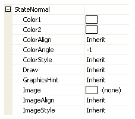
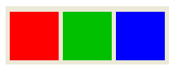
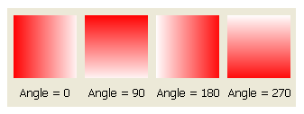
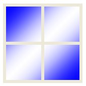
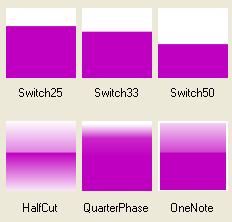
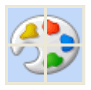

## Background

Most of the *Krypton* controls draw a background and so provide a set of
properties that allow customization of the background appearance. Each control
will provide the same set of properties for this task and so once you are
familiar with how they operate you can use this knowledge when dealing with any
of the controls. *Figure 1* shows the standard set of properties from the
*KryptonPanel* control.

 

*Figure 1 –Background display properties*

### Color Properties

The *ColorStyle* property determines how to make use of the *Color1*, *Color2*,
*ColorAlign* and *ColorAngle* set properties. When *ColorStyle* is defined as
*Solid* the background will be drawn using the *Color1* value and the other
color properties are ignored as not relevant. Figure 2 shows some *KryptonPanel*
instances with *Solid* defined.

 

*Figure 2 – ColorStyle = Solid*

All other *ColorStyle* values such as *Linear* and *Rounded* allow a gradient
effect between two colors, where *Color1* is the starting color and *Color2* is
the ending color. Now the *ColorAngle* property becomes important as it
determines the direction in which the transition occurs. Figure 3 shows the same
*Linear* style applied with different angles.

 

*Figure 3 – ColorStyle = Linear*

*ColorAlign* is used to decide how to calculate the starting and ending points
for the gradient effect. By default it will always start at the top left of the
control and ends at the bottom right of the control which gives appearance as
seen already in figure 3. If instead you choose the *Form* level alignment then
it will use the top left of the enclosing form and bottom right of the enclosing
form as the total area of the gradient. Figure 4 shows four panel controls all
with exactly the same *ColorAngle* of 45 degrees, *ColorAlign* of Form and
*ColorStyle* of *Sigma*.

 

*Figure 4 – ColorStyle =Sigma, ColorAlign = Form, ColorAngle = 45*

 

 

Figure 5 shows a selection of other *ColorStyle* values not yet demonstrated.
There are many other style options that you can explore in order to achieve
the exact look and feel you need. Try using the ones beginning with *Glass* to
achieve an effect similar to that of *Office 2007*.  

*Figure 5 - Selection of some other ColorStyle options*

### Image Properties

The image is always drawn after the color has been drawn. This ensures that any
alpha channel in the image will show through with the correct back color.
Providing an *Image* is optional and the related *ImageAlign* and *ImageEffect*
are only used when an *Image* has been specified. Figure 6 shows a
*KryptonPanel* with an *Image* of a red cross with an alpha channel so that the
*Color1* value of *Gold* shows through the transparent areas.

 

*Figure 6 – Color1 = Gold, Image contains alpha channel*

The *ImageAlign* property allows the image to be draw aligned against the *Form*
and not just the control instance. Figure 7 shows the use of four *KryptonPanel*
controls that are all assigned the same *Image*, *ImageAlign* and *ImageEffect*.

 

*Figure 7 – ImageAlign = Form, ImageEffect = Stretch*

The *ImageEffect* property describes how to draw the *Image* over the required
area. Figure 6 shows the example where *Stretch* is used to ensure the *Image*
exactly covers the entire area. Tiling options include *Tile*, *TileFlipX*,
*TileFlipY* and *TileFlipXY* that repeat over and over again until the entire
area is filled. Positioning options such as *TopLeft* and *BottomMiddle* allow
the image to be placed relative to both the vertical and horizontal edges.

 

### Other Properties

*Draw* is used to determine if the background of the control should be drawn at
all. If you set this to be *False* then no background drawing will take place
and so the control becomes transparent, instead showing through the container
that parents the control.

*GraphicsHint* is more specialized and used to describe the level of quality
used when drawing the background. This is generally only needed if you are using
a *Krypton* control that has a border as well as a background and where the
border itself is not being drawn but does provide rounding. For example,
figure 8 shows a *KryptonGroup* that has a solid blue background and a rounded
thick border of red.

 

*Figure 8 – KryptonGroup with rounded border*

If we decide to remove the border because we only want the background to be
visible but we still want the rounding effect then we set the borders *Draw*
property to be false and the result can be seen in figure 9.

 

*Figure 9 – Rounded border removed*

In figure 8 you can see that the rounded edges are of a poor quality. This is
where the *GraphicsHint* property is used to improve the smoothness of the
drawing by setting the *AntiAlias* value. Figure 10 shows the result of changing
the property.

 

*Figure 10 – GraphicsHint = AntiAlias*
